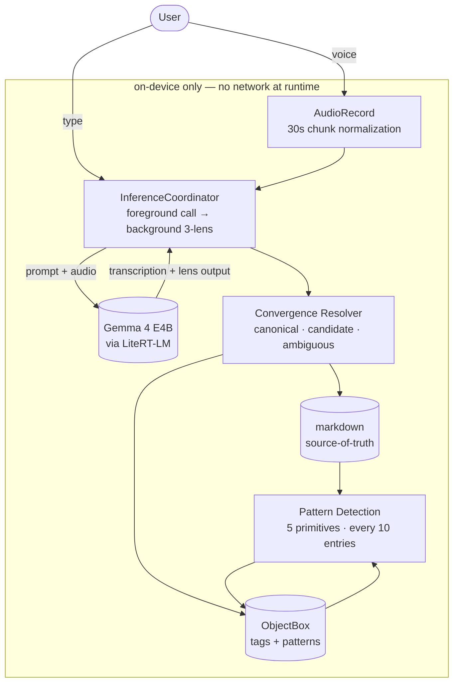

<p align="center">
  
</p>

# Vestige

On-device cognition tracker for ADHD-flavored adults. Anti-sycophant, behavioral, private.

> Built for the [Gemma 4 Challenge](https://dev.to/devteam/join-the-gemma-4-challenge-3000-prize-pool-for-ten-winners-23in) — submission category: Build with Gemma 4. Canonical product spec lives under [`docs/`](docs); see [`AGENTS.md`](AGENTS.md) for AI agent rules.

[](https://github.com/anchildress1/vestige/actions/workflows/ci.yml) [](https://github.com/anchildress1/vestige/actions/workflows/codeql.yml)

---

## Table of Contents

- [About](#about)
- [Status](#status)
- [Features](#features)
- [Tech Stack](#tech-stack)
- [Architecture](#architecture)
- [Project Structure](#project-structure)
- [Getting Started](#getting-started)
- [Configuration](#configuration)
- [Security & Privacy](#security--privacy)
- [How to Contribute](#how-to-contribute)
- [What's Next](#whats-next)
- [License](#license)
- [Acknowledgements](#acknowledgements)
- [Author](#author)

---

## About

Vestige observes behavioral traces and surfaces patterns without therapy framing, mood scoring, or wellness vocabulary. It runs Gemma 4 E4B locally via LiteRT-LM — your voice never leaves the device, the audio bytes are discarded after inference, and entries are stored as plain markdown you can export at any time.

The positioning is deliberate: cognition tracker, not journal app. Templates (`Crashed`, `Deep Space`, `Busy Stalling`, `Nonstop Spiral`, `Goblin Hours`, `Brain Dump`) are agent-emitted labels, not user-picked moods. Patterns are sourced — every claim cites the entries it counted. Full product spec: [`docs/concept-locked.md`](docs/concept-locked.md).

---

## Status

Phase-4 P0 shipped. The capture loop, history, pattern list + detail, settings, model-status, and the onboarding model-download UX are implemented against the canonical spec under [`docs/`](docs). Pattern lifecycle actions are Skip / Drop / Restart — closure is model-detected only (v1.5, see [`backlog.md`](docs/backlog.md) §`pattern-auto-close`). On-device verification (fresh install on the Galaxy S24 Ultra, STT no-regression round-trip) is the remaining gate before the v1 cut; risk through phases 1–3 was managed via five stop-and-test points (STT-A–E). Full README pass + demo video land in Phase 6 — see [`docs/PRD.md`](docs/PRD.md) §Timeline.

---

## Features

| Feature | What it does |
|---|---|
| Voice capture | `AudioRecord` → Gemma 4 E4B native audio modality. No third-party STT. Audio bytes discarded after inference. |
| Multi-lens extraction | Each entry runs through 3 lenses × 5 surfaces; convergence determines per-field confidence. See [ADR-002](docs/adrs/ADR-002-multi-lens-extraction-pattern.md). |
| Three personas | Witness / Hardass / Editor — tone-only variants. They do not fork extraction logic. |
| Pattern detection | Five primitives counted over the last 90 days; sourced (counts, dates, snippets), no feelings or motivation interpretation. See [ADR-003](docs/adrs/ADR-003-pattern-detection-and-persistence.md). |
| Markdown source-of-truth | One file per entry, exportable, schema-versioned. ObjectBox is a structured cache, not the source. |
| Pattern lifecycle | Skip (returns in 7 days) / Drop (noise, archived) / Restart, with Undo. Closure is model-detected only — v1.5. |
| Export | System-picker (SAF) zip of per-entry markdown. No storage permission; failures surface, never silent. |
| Hybrid retrieval | Keyword + tags + recency. Vector layer (EmbeddingGemma 300M) ships only if STT-E passes. |
| Local-only | Zero outbound network calls during normal operation; model download is the only network event. Verified with `tcpdump`. |

---

## Tech Stack

- Kotlin `2.3.21` + Jetpack Compose (BOM `2026.05.00`), AGP `9.2.1`
- Gradle KTS + version catalog ([`gradle/libs.versions.toml`](gradle/libs.versions.toml))
- Gemma 4 E4B via LiteRT-LM (`com.google.ai.edge.litertlm:litertlm-android:0.11.0`), on-device only
- ObjectBox `5.4.2` (structured tags + pattern store) + markdown (entry source-of-truth)
- Android `minSdk 31` / `targetSdk 35` / `compileSdk 36`, JVM toolchain 25 (Java source/target compat 17)

---

## Architecture

Four-module split with manual constructor injection through a single `AppContainer` ([ADR-001 §Q1–Q2](docs/adrs/ADR-001-stack-and-build-infra.md)). Foreground call returns transcription + persona-flavored follow-up fast; the 3-lens convergence pass runs in the background and writes canonical / candidate / ambiguous fields when it lands.



Module boundaries: `:app` (UI), `:core-inference` (LiteRT-LM + lens composition), `:core-storage` (ObjectBox + markdown), `:core-model` (domain types). Ownership detail: [`docs/architecture-brief.md`](docs/architecture-brief.md).

---

## Project Structure

```
.
├── app/                       # :app — Compose UI, navigation, AppContainer (manual DI)
├── core-model/                # :core-model — domain types, manifests, no Android deps
├── core-inference/            # :core-inference — LiteRT-LM engine + 3-lens composition
├── core-storage/              # :core-storage — ObjectBox + markdown source-of-truth
├── docs/                      # canonical product/architecture/UX spec
│   ├── README.md              # reading order + file inventory
│   ├── PRD.md                 # P0/P1/P2 requirements + phase schedule
│   ├── concept-locked.md      # full product spec
│   ├── adrs/                  # ADR-001..013 (stack, lenses, patterns, lifecycle, …)
│   ├── architecture-brief.md
│   ├── design-guidelines.md
│   ├── ux-copy.md             # locked microcopy authority
│   ├── spec-pattern-action-buttons.md
│   ├── sample-data-scenarios.md
│   ├── backlog.md             # deferred features w/ unblock conditions
│   └── stories/               # phase-1..7 build queue
├── poc/                       # Compose-port reference (JSX prototypes + screenshots)
├── gradle/                    # version catalog + dependency verification
├── scripts/                   # doctor, lint, secret scan helpers
├── AGENTS.md                  # AI implementor guardrails (authoritative)
├── CLAUDE.md                  # Claude Code → AGENTS.md pointer
├── lefthook.yml               # pre-commit / commit-msg / pre-push hooks
├── Makefile                   # local CI surface
├── LICENSE
└── README.md
```

Four-module split per [ADR-001](docs/adrs/ADR-001-stack-and-build-infra.md): `:app` (UI) depends on `:core-inference`, `:core-storage`, and `:core-model`; the core modules do not depend on `:app`.

---

## Getting Started

### Prerequisites

| Tool | Required for | Install |
|---|---|---|
| JDK 25 LTS (Temurin) | Gradle runtime + Kotlin toolchain | `brew install --cask temurin` |
| Android SDK + `adb` | build + install on device | Android Studio, or `brew install --cask android-commandlinetools` |
| System Gradle (optional) | regenerating the wrapper jar (`make bootstrap-wrapper`); not needed for routine builds, since `gradle/wrapper/gradle-wrapper.jar` is committed | `brew install gradle` |
| `lefthook` | git hooks | `brew install lefthook` |
| `gitleaks` | secret scan | `brew install gitleaks` |
| `actionlint` | workflow lint | `brew install actionlint` |
| `ktlint` | format + lint Kotlin | `brew install ktlint` |
| `detekt` | static analysis Kotlin | `brew install detekt` |
| `gh` | repo ops | `brew install gh` |

`ANDROID_HOME` must be set and `$ANDROID_HOME/platform-tools` must be on `PATH` so `adb` resolves. Gradle dependency verification is pinned in `gradle/verification-metadata.xml`; refresh it only when changing dependencies.
SonarCloud analysis runs through the Gradle `sonar` task in CI rather than a standalone scanner config, because Android builds deserve one source of truth at a time.

### Build

```bash
make install    # bootstrap gradle wrapper, install lefthook hooks
make doctor     # verify local toolchain and environment variables
make build      # assemble debug APK
make test       # unit tests + Kover XML coverage + 80% verification
make lint       # ktlint + detekt + Android lint
make verify     # lint + test + build + staged secret scan
make ci         # full local check (lint + test + build)
make clean
```

### Run on a device

Reference device: Galaxy S24 Ultra. External devices are best-effort; submission promise is Android 14+, 8 GB RAM, 6 GB free storage.

**One-time phone setup**

1. **Settings → About phone** → tap **Build number** 7 times to unlock developer options.
2. **Settings → Developer options** → enable **USB debugging**. Optional: enable **Wireless debugging** if you'd rather not cable up.
3. (Optional) **Stay awake** while charging — speeds iteration.

**Connect**

USB:

```bash
adb devices
# expect: <serial>    device
# if "unauthorized", accept the prompt on the phone (check "Always allow")
```

Wireless (Android 11+):

```bash
# On phone: Developer options → Wireless debugging → Pair device with pairing code
adb pair <ip:port>      # use the pair port + 6-digit code shown on phone
adb connect <ip:port>   # then use the connect port shown on phone
adb devices             # verify
```

**Install + launch**

```bash
./gradlew :app:installDebug
adb shell monkey -p dev.anchildress1.vestige -c android.intent.category.LAUNCHER 1
```

`installDebug` builds and installs in one step. The `monkey` invocation just opens the launcher activity without you having to tap the icon.

Manual APK install:

```bash
./gradlew :app:assembleDebug
adb install -r app/build/outputs/apk/debug/app-debug.apk
```

**Tail logs**

```bash
adb logcat -s "VestigeApplication:*" "AndroidRuntime:E" "*:F"
```

**Reinstall clean**

```bash
adb uninstall dev.anchildress1.vestige
./gradlew :app:installDebug
```

**Troubleshooting**

| Symptom | Fix |
|---|---|
| `adb: command not found` | `export PATH="$ANDROID_HOME/platform-tools:$PATH"` in your shell profile |
| `INSTALL_FAILED_NO_MATCHING_ABIS` | APK didn't include `arm64-v8a`. Verify with `unzip -l app/build/outputs/apk/debug/app-debug.apk \| grep arm64-v8a` |
| `INSTALL_FAILED_USER_RESTRICTED` | Disable **Verify apps over USB** in Developer options |
| App crashes on launch | `adb logcat AndroidRuntime:E *:S` for stack trace |
| Themed monochrome icon on Android 13+ | Expected — placeholder icon; final design lands Phase 6 |

---

## Configuration

v1 has effectively zero configuration. The model artifact downloads on first launch over Wi-Fi (~3.7 GB) into `Context.filesDir/models/`. A cheap presence + size probe gates UI readiness on every cold start; full SHA-256 verification is deferred to the engine load path so onboarding never hashes the multi-GB artifact on the UI thread (Story 4.3). Persona default is set during onboarding and changeable from settings. Pattern detection threshold (10 entries) and callout cooldown (3 entries) are hardcoded for v1 per [`docs/ux-copy.md` §"Locked v1 behavior"](docs/ux-copy.md). No env vars, no `.env` file, no remote-config layer — adding any of those is a P0 violation per [ADR-001 §Q7](docs/adrs/ADR-001-stack-and-build-infra.md).

---

## Security & Privacy

Privacy is the differentiator, not a side feature.

- **Zero outbound network calls during normal operation.** The model download (one-time, Wi-Fi, Hugging Face) is the sole network event. Verified with `tcpdump`; the proof clip is part of the demo video.
- **Audio bytes discarded after inference.** Transcription persists as text (the `entry_text` substrate); raw audio never lands on disk as product data.
- **No analytics, telemetry, crash beacons, remote config, CDN fonts.** Crash logs are local; user can export from settings.
- **Network enforcement is code, not vibes.** A `NetworkGate` abstraction owns the only HTTP path; default state is `SEALED`, `OPEN` only during model download. Direct `OkHttpClient` / `URL.openConnection` construction outside `NetworkGate` is forbidden and grep-checked in CI. See [ADR-001 §Q7](docs/adrs/ADR-001-stack-and-build-infra.md).
- **No proactive crisis triage.** If the user explicitly asks for self-harm help, a static local message points to local emergency services. No diagnosis, no network call.

Contributors: do not introduce dependencies that pull in Firebase, Crashlytics, Segment, Mixpanel, or any analytics SaaS. Do not add a fonts CDN. Do not call out to a cloud LLM as a fallback. Any of these invalidates the entire submission.

---

## How to Contribute

PRs are not accepted during the challenge window (until 2026-05-24). Issues are welcome — use the GitHub issue tracker. Post-submission, see [`AGENTS.md`](AGENTS.md) and [`backlog.md`](docs/backlog.md) for the contribution surface.

Branches and commits follow [`AGENTS.md`](AGENTS.md) and the repo conventions: atomic, GPG-signed, a `Generated-by:` footer on AI-authored commits (e.g. `Generated-by: claude-opus-4-7`), Conventional Commits, never on `main`.

---

## What's Next

v1 ships 2026-05-24. Deferred features live in [`backlog.md`](docs/backlog.md) — v1.5 / v2 / STT-conditional, with explicit unblock-conditions per entry. No "coming soon" handwaving.

---

## License

[Polyform Shield 1.0.0](LICENSE) + Supplemental Terms. Source-available, not open-source: read it, run it, modify it for personal or internal use. Don't sell it, don't ship a paid product on top of it, don't use it to compete with Vestige itself. The full grant and exceptions are in [LICENSE](LICENSE) — that is the legally-binding version; this paragraph is just the plain-English flavor.

---

## Acknowledgements

- Google's **Gemma team** for the E4B model and the native audio modality that made this entire concept tractable on a phone.
- The **LiteRT-LM team** ([`google-ai-edge/LiteRT-LM`](https://github.com/google-ai-edge/LiteRT-LM)) for the Android SDK that lets Kotlin code run a multimodal LLM without writing JNI by hand.
- **ObjectBox** for an embedded DB that does not require an SQL ceremony.
- **Hugging Face / `litert-community`** for hosting the pre-converted [`gemma-4-E4B-it-litert-lm`](https://huggingface.co/litert-community/gemma-4-E4B-it-litert-lm) artifact.
- The **Polyform Project** for licenses that admit not every project is MIT-shaped.

---

## Author

[Ashley Childress](https://github.com/anchildress1) ([@anchildress1](https://github.com/anchildress1)). Vestige is an Android side-build aimed at the Gemma 4 Challenge "Build with Gemma 4" prize. The brand voice and product opinions are entirely intentional.
