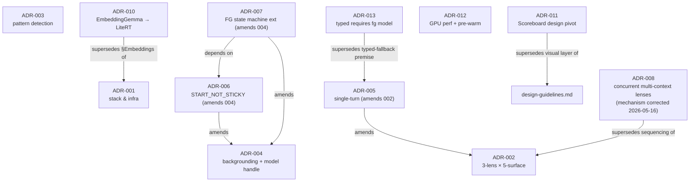
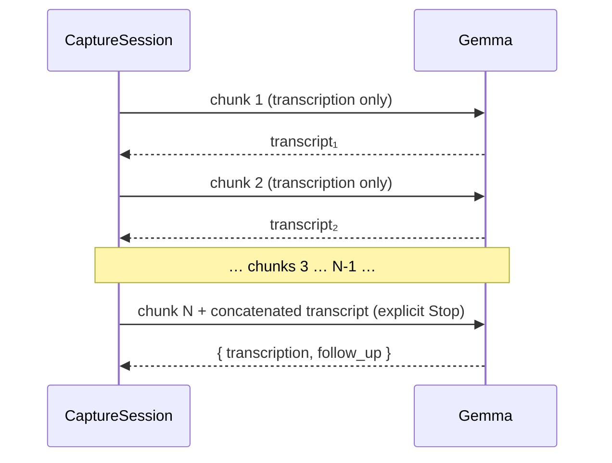
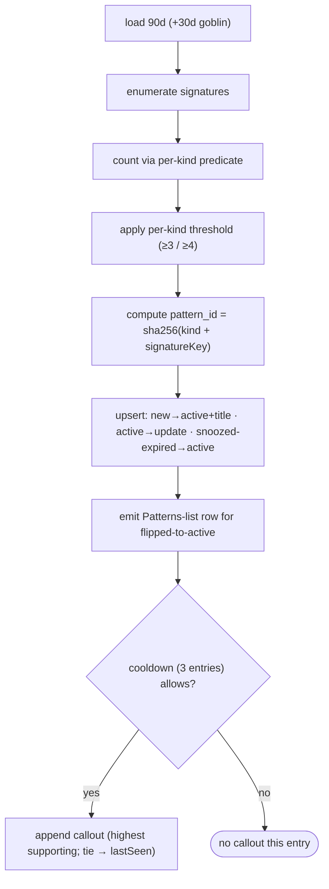
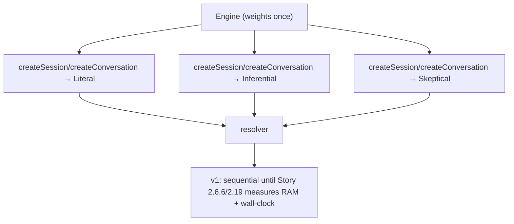
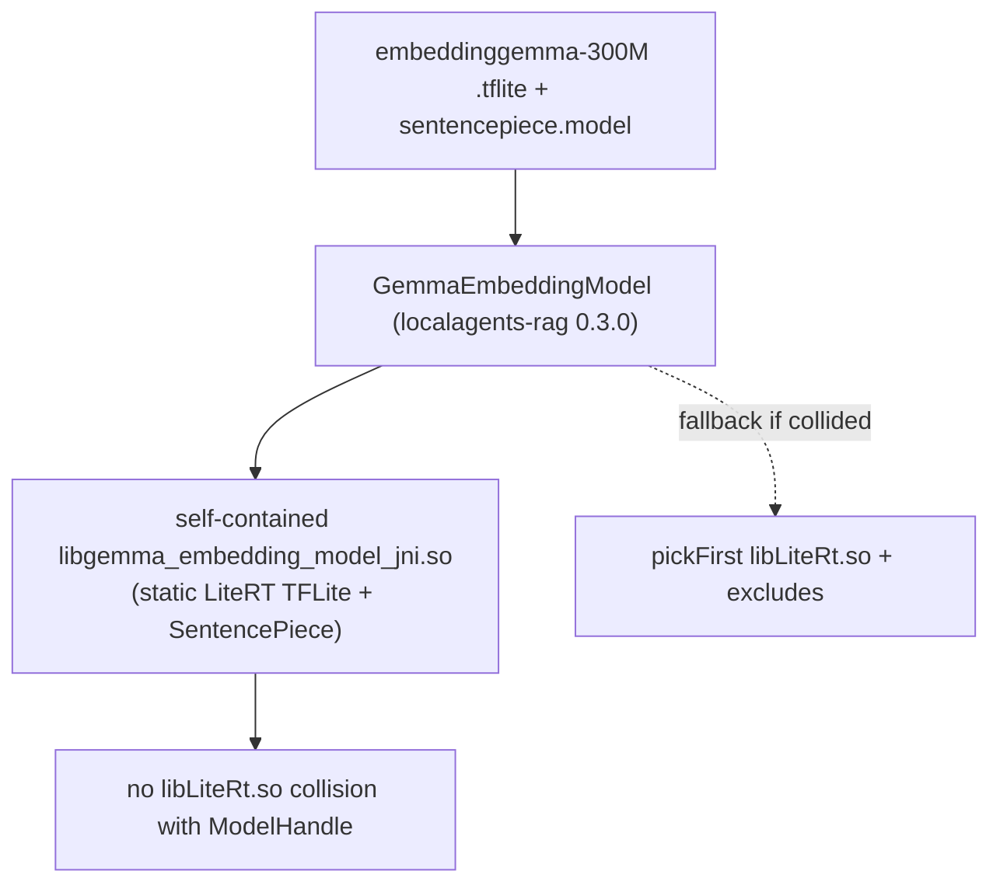
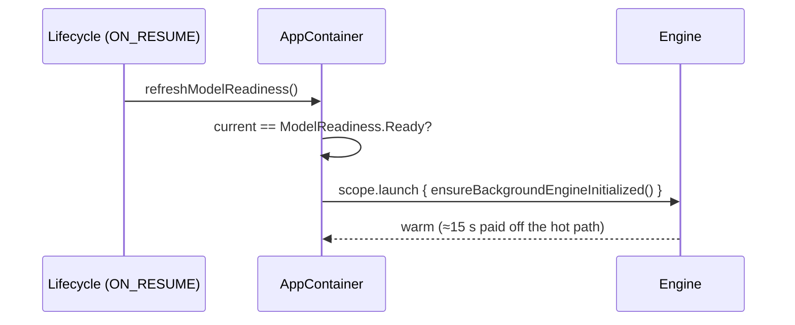

# ADR Decisions

Every live ADR as written, assuming the full v1 feature set is complete. (ADR-009 was **deleted
2026-05-16** as a mis-scoped-probe mistake — not superseded; ADR-008 restored. There is no ADR-009.)
`backlog.md` is out of scope by design. Shared state machines live in
[state-diagrams.md](state-diagrams.md) and are cross-linked rather than redrawn.

---

## Supersession & amendment graph

---

## ADR-001 — v1 Stack & Build Infrastructure

**Status:** Accepted. §Embeddings/Q6 superseded by ADR-010.
**Decision:** Lock the stack; 4-module split (`:app` / `:core-model` / `:core-inference` /
`:core-storage`); `AppContainer` constructor-DI built once in `Application.onCreate`;
`NetworkGate` (`SEALED` default, `OPEN` only for download); resolve Q1–Q8. State machines for
`NetworkGate`, `extraction_status`, and CaptureSession-discard are in
[state-diagrams.md](state-diagrams.md); module graph + DI in [architecture.md](architecture.md).

**Q4 — audio chunking (>30 s):** ≤30 s is one call; >30 s is N sequential 30 s chunks,
transcription-only for 1…N−1, follow-up on the final chunk.

---

## ADR-002 — Multi-Lens Extraction Pattern

**Status:** Accepted. Amended by ADR-005; sequencing superseded by ADR-008 (concurrent
multi-context; mechanism corrected 2026-05-16 — `createSession`/`createConversation`, not
`Session.clone()`). v1 ships sequential pending Story 2.6.6 / 2.19 measurement.
**Decision:** 3 independent lens calls (Literal / Inferential / Skeptical), each composing all 5
surfaces (Behavioral / State / Vocabulary / Commitment / Recurrence); a **deterministic Kotlin**
convergence resolver (not a 4th model call). Two-tier: foreground returns
`{transcription, follow_up}`; background runs the 3 lenses + resolver in 30–90 s. **Agreement
predicate is written against the storage enum** (`template_label` ∈ {Aftermath, Tunnel exit,
Concrete shoes, Decision spiral, Goblin hours, Audit} — positional 1:1 with the
`concept-locked` product names). Full sequence + resolver decision:
[llm-functionality.md](llm-functionality.md).

---

## ADR-003 — Pattern Detection & Persistence

**Status:** Accepted. Lifecycle revised by the 2026-05-13 / 13b / 15 addenda.
**Decision:** 5 sourced content-addressable primitives (`template_recurrence`,
`tag_pair_co_occurrence`, `time_of_day_cluster`, `commitment_recurrence`, `vocab_frequency`),
deterministic Kotlin pass over the last 90 days, run every 10 entries; ObjectBox keyed by
`sha256(Json{kind, signatureKey})`; 3-entry global callout cooldown. Lifecycle (incl. the
13/13b Skip/Drop/Restart revision, `CLOSED` model-only) is in
[state-diagrams.md](state-diagrams.md).

---

## ADR-004 — App Backgrounding & Model-Handle Lifecycle

**Status:** Accepted. Amended by ADR-006 (restart policy) and ADR-007 (state machine).
**Decision:** Conditional foreground service — normal priority by default, promote on first
`extraction_status = RUNNING`, demote after all terminal **+30 s keep-alive**. Notification:
`Reading the entry.`, channel `vestige.local_processing`, importance LOW, tap → History.
**Addendum 2026-05-14:** the 3-screen onboarding hub supersedes the dedicated Screen 3.5; the
notification permission moves to the optional `Notify` switch. Full 5-state + failure machine:
[state-diagrams.md](state-diagrams.md).

---

## ADR-005 — STT-B Scope & v1 Single-Turn (amends ADR-002)

**Status:** Accepted. Amends ADR-002 §Multi-turn / §Q5 / Action Item #1.
**Decision:** The STT-B `retention=0.0/3` verdict is scoped to the prompt-stuffing pattern only
(the SDK stateful path was unmeasured). v1 ships **single-turn-per-capture**: a fresh
`CaptureSession` per record, no prior-turn context, terminal at `RESPONDED` / `ERROR`. The
foreground signature becomes `runForegroundCall(audio, persona)`.
**Addendum 2026-05-15:** pattern callouts — not the follow-up — are the cross-entry surface.

---

## ADR-006 — Foreground Service Restart Policy (amends ADR-004)

**Status:** Accepted. Amends ADR-004 §Crash recovery.
**Decision:** `BackgroundExtractionService.onStartCommand` returns **`START_NOT_STICKY`**
(kills phantom-notification restarts). Crash recovery flows entirely through the ADR-001 Q3
cold-start sweep (`findNonTerminalEntryIds`), not service stickiness. Promote dispatch becomes a
synchronous `onPromoteRequested` callback (no StateFlow replay hazard).

---

## ADR-007 — Foreground Service State Machine Extensions (amends ADR-004)

**Status:** Accepted. Amends ADR-004 §State Machine. Depends on ADR-006.
**Decision:** Add three failure pathways — (1) `DEMOTING → PROMOTING` when work arrives during
demote; (2) `PROMOTING → NORMAL → PROMOTING` via a single bounded 5 s retry on
`onForegroundStartFailed`; (3) any active state `→ PROMOTING` on `onServiceKilled` (OS-only
kill). `onStartCommand` resolves 5 cases by current state. Drawn in
[state-diagrams.md](state-diagrams.md).

---

## ADR-008 — Concurrent Multi-Context 3-Lens Execution

**Status:** Accepted. **Decision stands; mechanism + performance premise corrected 2026-05-16**
(ADR-008 §Correction). The interim ADR-009 that declared this SDK-impossible was a
mis-scoped-probe mistake and was **deleted** — there is no ADR-009.
**Decision:** one Engine (weights loaded once) drives **independent** per-lens contexts via
`Engine.createSession(SessionConfig)` / `createConversation(ConversationConfig)` on the pinned
`0.11.0` — **no** `Session.clone()`, **no** CoW shared prefix (each context composes its own).
A single GPU serializes at the command queue, so the win is non-blocking foreground preempt,
**not** a literal 3×; realized wall-clock + concurrent-context RAM are unmeasured. v1 ships
ADR-002 sequential until Story 2.6.6 / 2.19 measures and decides adoption — a scope position,
not an SDK limit.

---

## ADR-010 — EmbeddingGemma Runtime Swap → LiteRT (supersedes ADR-001 §Embeddings)

**Status:** Accepted. Supersedes ADR-001 Locked-Stack Embeddings row + §Q6.
**Decision:** EmbeddingGemma 300M loads through **LiteRT (TFLite)**, not LiteRT-LM (the HF
artifact ships only `.tflite`). Active path (Addendum 2026-05-11): load via
`localagents-rag:0.3.0` → `GemmaEmbeddingModel(modelPath, tokenizerPath, useGpu)`, which bundles
a self-contained `.so` and so avoids the `libLiteRt.so` collision.

---

## ADR-011 — Design Language: Mist → Scoreboard

**Status:** Accepted. **Visual-only** — supersedes the design-guidelines visual sections + Story
4.1 tokens. All behavioral ADRs (002 / 003 / 004 / 005 / 010) hold unchanged.
**Decision:** Replace Mist with Scoreboard wholesale in `:app/.../ui/**`. New token set
(`lime` = signal, `coral` = heat, never co-occurring; `teal` = resolved), sharper radii, new
motion keyframes, new primitives (`BigStat`, `Pill`, `TraceBarE`, `EyebrowE`, `AppTop`, …);
`MistHero` / `FogDrift` / `NoiseGrain` deleted. Story 4.1.5 carries the rebuild before Story 4.2.

---

## ADR-012 — GPU Inference Performance Gaps

**Status:** Accepted. Decision 1 blocked.
**Decision:** (1) bundle the OpenCL TopK sampler `.so` — **blocked**, not present in the 0.11.0
AAR, so no `jniLibs` addition lands; (2) **pre-warm** the engine on model-ready —
`refreshModelReadiness()` launches `ensureBackgroundEngineInitialized()` when
`ModelReadiness.Ready`, hiding the ~15 s cold init. **Addendum 2026-05-16:** CPU fallback is a
bug to fix at root, not a documented limitation; ~7–11 s/call GPU on E4B is the baseline.

---

## ADR-013 — Typed Entry Requires the Foreground Model

**Status:** Accepted. Supersedes the ADR-005-era model-free typed-fallback premise.
**Decision:** Typed runs the **same** foreground call as voice
(`runForegroundTextCall(text, persona)`, `Content.Text`, shared `CaptureViewModel.runForeground`,
same `{transcription, follow_up}` parser). The model is **required**: when
`ModelReadiness != Ready`, `submitTyped` is a silent no-op (parity with a disabled REC). The
old `saveTypedEntry` / typed-`PENDING` branch is **deleted** — no compatibility shim. Flow in
[user-flows.md](user-flows.md).
