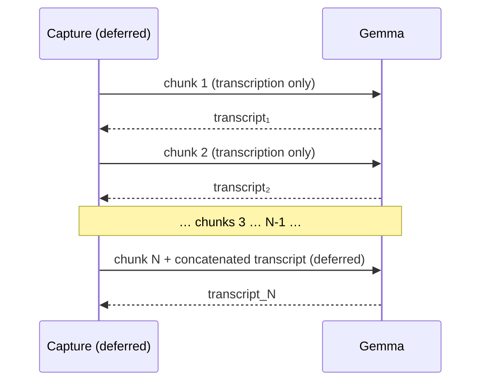
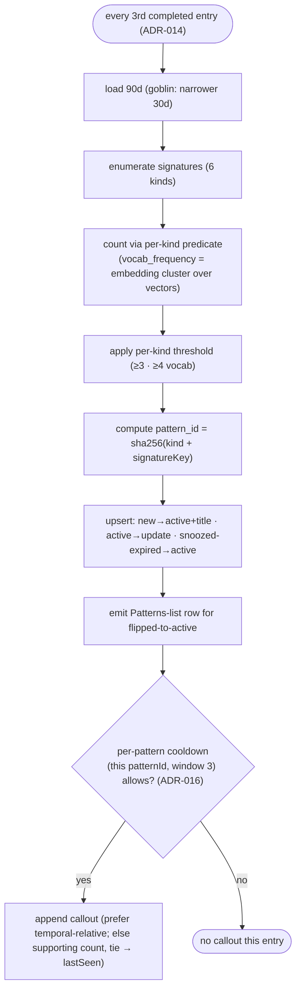
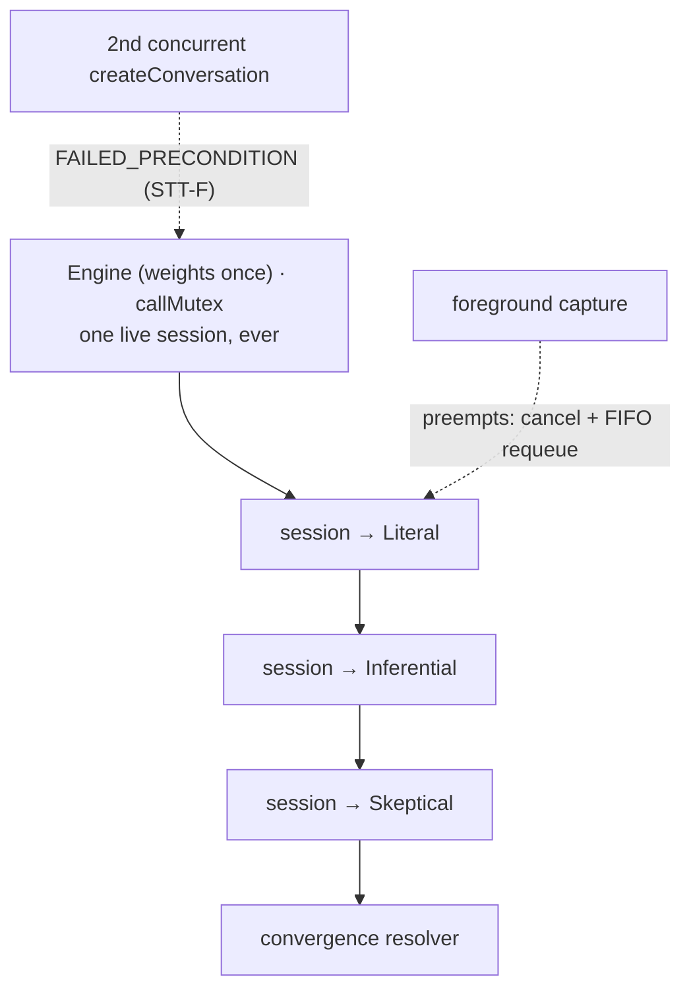
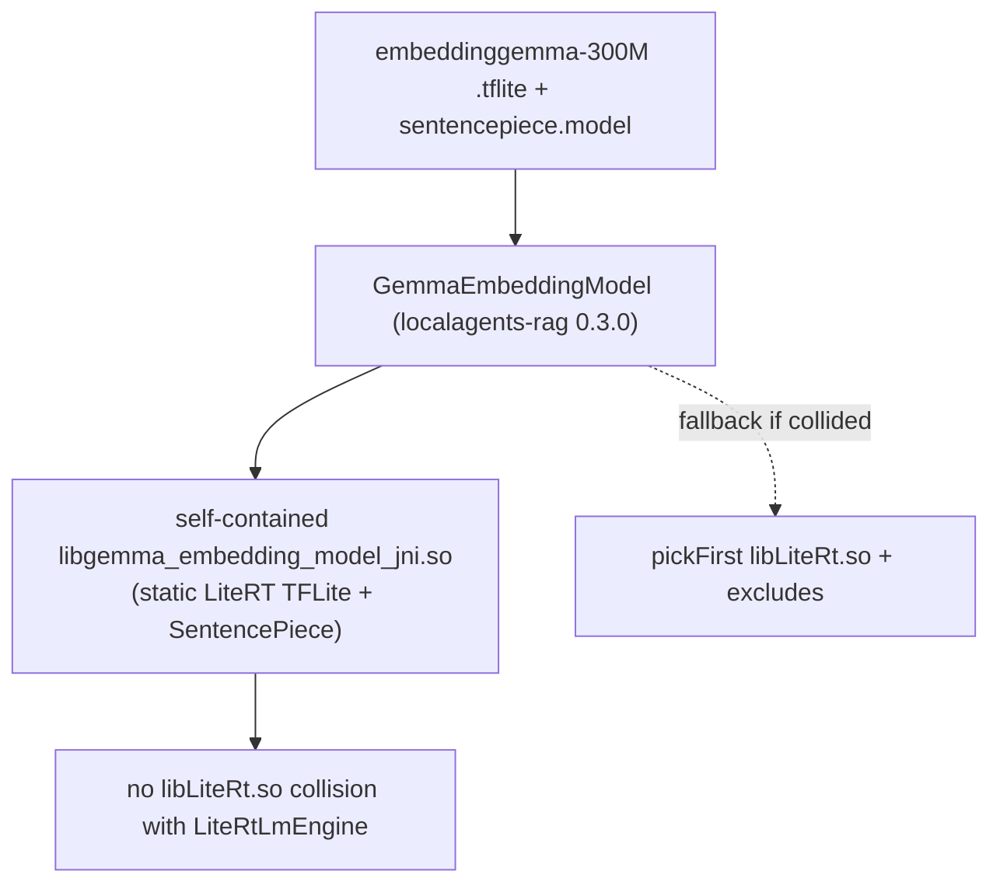
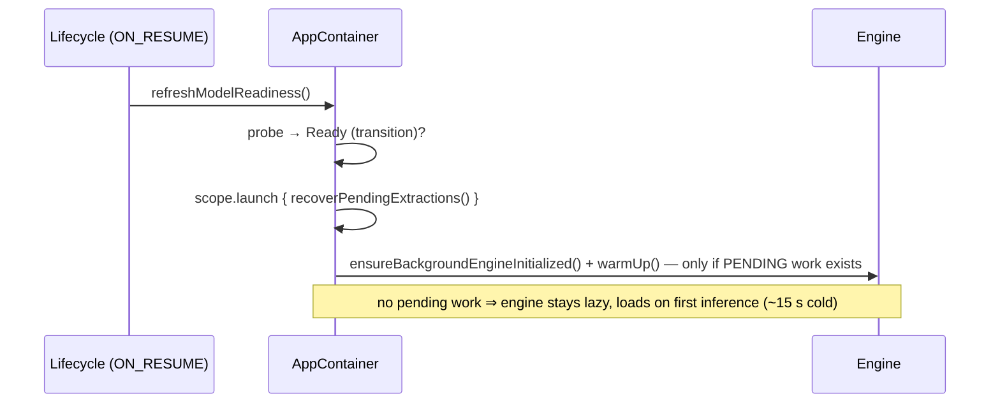
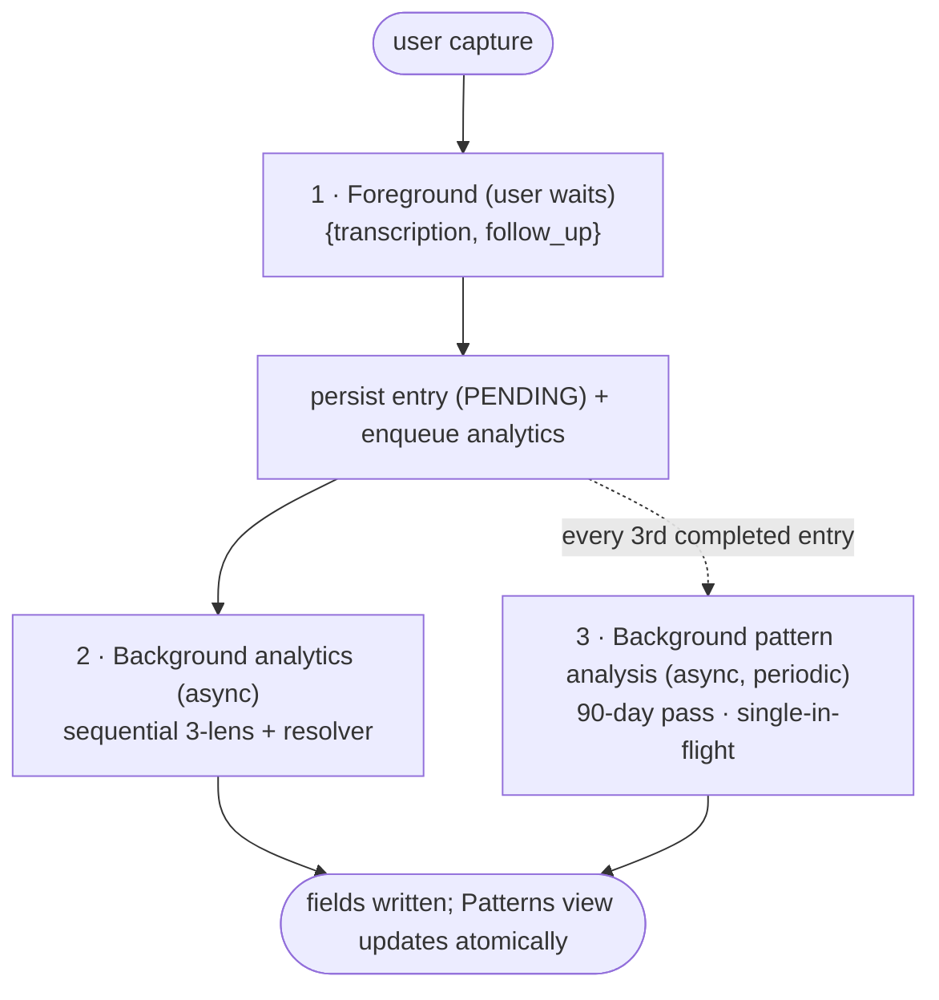
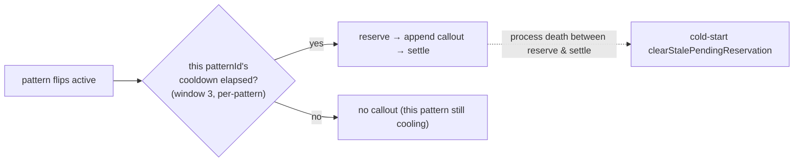
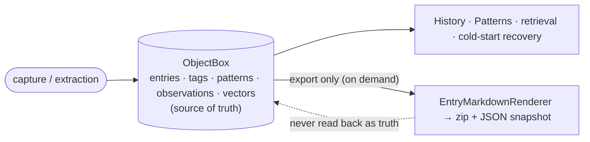
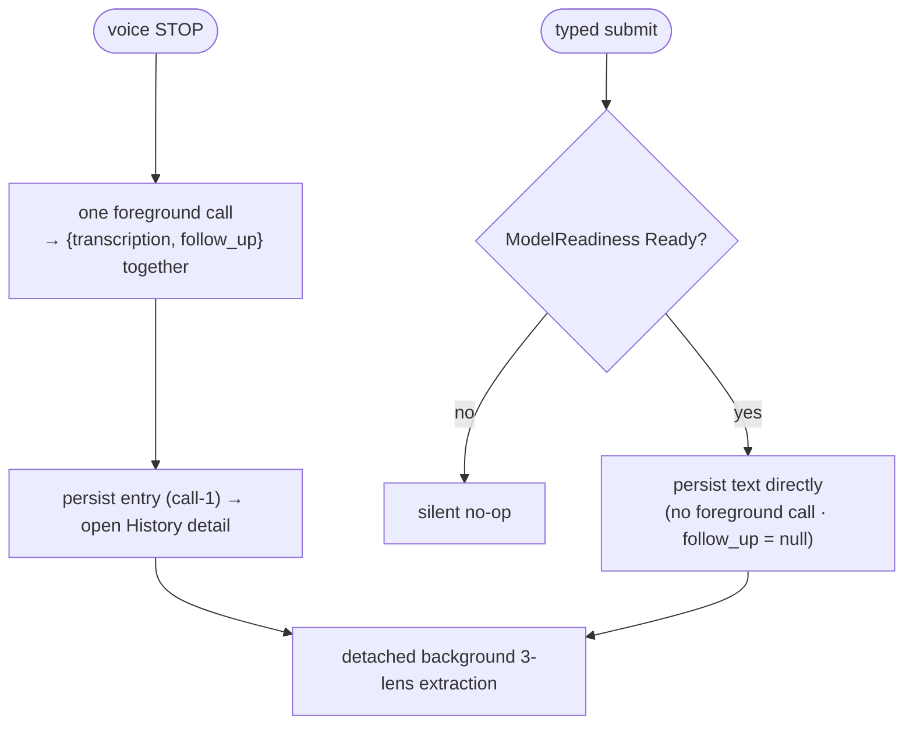

# ADR Decisions

Every live ADR (001–018) as written. Notes that change how to read this page:

- **ADR-009 was deleted 2026-05-16** as a mis-scoped-probe mistake — not superseded. There is no ADR-009.
- **ADR-008's concurrent-multi-context decision is REVERSED** (2026-05-17, STT-F): `litertlm-android:0.11.0`
  is single-session, so the 3 lenses run **sequentially** through one engine. ADR-002's sequential
  rule is restored.
- **ADR-015 is `Proposed`** (model-owned pattern identity) — not implemented on `main`; shown dashed.

`backlog.md` is out of scope by design. Shared state machines live in
[state-diagrams.md](state-diagrams.md) and are cross-linked rather than redrawn.

---

## Supersession & amendment graph

```mermaid
flowchart TD
    accTitle: ADR supersession and amendment relationships
    accDescr: ADR-006 and ADR-007 amend ADR-004; ADR-007 depends on ADR-006. ADR-005 amends ADR-002. ADR-008's concurrent-multi-context decision is reversed by its 2026-05-17 addendum and no longer supersedes ADR-002 — sequential 3-lens is restored. The interim ADR-009 was deleted as a mistake and is not in the graph. ADR-010 supersedes ADR-001's embeddings section; ADR-017 supersedes ADR-001's storage source-of-truth clause. ADR-011 supersedes the design-guidelines visual layer only. ADR-014 supersedes ADR-002's two-tier section, ADR-003's pattern-detection trigger, and ADR-008's correction premise. ADR-016 supersedes ADR-003's global cooldown with a per-pattern one. ADR-013 supersedes the ADR-005-era typed-fallback premise. ADR-018 supersedes ADR-014's detached follow-up call and ADR-013's typed model call. ADR-015 is Proposed and supersedes ADR-014's pattern cadence and ADR-003's detection algorithm once built.

    A001["ADR-001<br/>stack & infra"]
    A002["ADR-002<br/>3-lens × 5-surface"]
    A003["ADR-003<br/>pattern detection"]
    A004["ADR-004<br/>backgrounding + model handle"]
    A005["ADR-005<br/>single-turn (amends 002)"]
    A006["ADR-006<br/>START_NOT_STICKY (amends 004)"]
    A007["ADR-007<br/>FG state machine ext (amends 004)"]
    A008["ADR-008<br/>concurrent lenses — REVERSED 2026-05-17<br/>(SDK single-session; sequential restored)"]
    A010["ADR-010<br/>EmbeddingGemma → LiteRT"]
    A011["ADR-011<br/>Scoreboard design pivot"]
    A012["ADR-012<br/>GPU perf + pre-warm"]
    A013["ADR-013<br/>typed requires fg model"]
    A014["ADR-014<br/>fg/bg split + periodic pattern analysis"]
    A015["ADR-015<br/>model-owned pattern id (PROPOSED)"]
    A016["ADR-016<br/>per-pattern callout cooldown"]
    A017["ADR-017<br/>ObjectBox = entry source of truth"]
    A018["ADR-018<br/>inline foreground follow-up"]

    A005 -- amends --> A002
    A006 -- amends --> A004
    A007 -- amends --> A004
    A007 -- depends on --> A006
    A008 -. "REVERSED — no longer supersedes" .-> A002
    A010 -- supersedes §Embeddings of --> A001
    A017 -- supersedes §storage-SOT of --> A001
    A011 -- supersedes visual layer of --> Design["design-guidelines.md"]
    A013 -- supersedes typed-fallback premise of --> A005
    A014 -- supersedes §two-tier of --> A002
    A014 -- supersedes pattern-trigger of --> A003
    A014 -. supersedes §Correction premise of .-> A008
    A016 -- supersedes §Cooldown of --> A003
    A018 -- supersedes detached call-2 of --> A014
    A018 -- supersedes typed model call of --> A013
    A015 -. "PROPOSED — supersedes cadence of" .-> A014
    A015 -. "PROPOSED — supersedes algo of" .-> A003
```

---

## ADR-001 — v1 Stack & Build Infrastructure

**Status:** Accepted. §Embeddings/Q6 superseded by ADR-010; §storage source-of-truth clause
superseded by ADR-017 (Addendum 2026-05-20 — ObjectBox is authoritative, markdown is export-only).
**Decision:** Lock the stack; 4-module split (`:app` / `:core-model` / `:core-inference` /
`:core-storage`); `AppContainer` constructor-DI built once in `Application.onCreate`;
`NetworkGate` (`SEALED` default, `OPEN` only for download); resolve Q1–Q8. State machines for
`NetworkGate` and `extraction_status` are in [state-diagrams.md](state-diagrams.md); module graph
+ DI in [architecture.md](architecture.md).

**Q4 — audio chunking (>30 s):** ≤30 s is one foreground call; **>30 s is deferred and not built
in v1** — `AudioCapture` hard-caps each recording at 30 s. The sequence below is the *deferred*
design, shown for completeness only (the historical `CaptureSession` is retired; capture now runs
through `CaptureViewModel` + `AudioCapture`).

```mermaid
sequenceDiagram
    accTitle: ADR-001 Q4 over-30-second audio chunking (DEFERRED — not built in v1)
    accDescr: Deferred design only. For audio longer than 30 seconds, chunks 1 through N minus 1 would be transcription-only calls and the final chunk would return transcription and one follow-up. v1 does not implement this — AudioCapture hard-caps each recording at 30 seconds.

    participant Cap as Capture (deferred)
    participant G as Gemma
    Cap->>G: chunk 1 (transcription only)
    G-->>Cap: transcript₁
    Cap->>G: chunk 2 (transcription only)
    G-->>Cap: transcript₂
    Note over Cap,G: … chunks 3 … N-1 …
    Cap->>G: chunk N + concatenated transcript (deferred)
    G-->>Cap: transcript_N
```

---

## ADR-002 — Multi-Lens Extraction Pattern

**Status:** Accepted. Amended by ADR-005. Sequencing: ADR-008 briefly superseded it with
concurrent multi-context, but ADR-008 was **reversed 2026-05-17** (0.11.0 is single-session), so
ADR-002's **sequential** 3-lens rule is **restored**. The two-tier boundary is locked by ADR-014
(foreground is the only user-blocking call); ADR-018 makes the voice follow-up inline.
**Decision:** 3 independent lens calls (Literal / Inferential / Skeptical), each composing all 5
surfaces (Behavioral / State / Vocabulary / Commitment / Recurrence); a **deterministic Kotlin**
convergence resolver (not a 4th model call). Two-tier: voice foreground returns
`{transcription, follow_up}`; typed entries persist text only (no foreground call — ADR-018);
background runs the 3 lenses + resolver sequentially (measured ≈44 s/entry, 25–55 s band — STT-F).
**Agreement predicate is written against the storage enum** (`template_label` ∈ {Aftermath,
Tunnel exit, Stalled, Decision spiral, Goblin hours, Audit} — positional 1:1 with the
`concept-locked` product names). Full sequence + resolver decision:
[llm-functionality.md](llm-functionality.md).

---

## ADR-003 — Pattern Detection & Persistence

**Status:** Accepted. Lifecycle revised by the 2026-05-13 / 13b / 15 addenda; trigger superseded by
ADR-014 (periodic), cooldown superseded by ADR-016 (per-pattern), and one primitive added 2026-05-19.
**Decision:** **6** sourced content-addressable primitives (`PatternKind`: `template_recurrence`,
`tag_pair_co_occurrence`, `time_of_day_cluster`, `commitment_recurrence`, `vocab_frequency`,
`temporal_relative`); deterministic Kotlin pass over the last 90 days; ObjectBox keyed by
`sha256(Json{kind, signatureKey})`. Two live deltas vs. the ADR-003 body: the **trigger is periodic
— every 3 completed entries**, not threshold-`≥10` (ADR-014 + Addendum 2026-05-19); the **callout
cooldown is per-pattern** (`patternId`-scoped, window 3), not global (ADR-016). `vocab_frequency` is
detected by **embedding cluster** over entry vectors (keyed on the cluster's dominant tone word),
not a raw token count. Lifecycle (the 13/13b Skip/Drop/Restart revision, `CLOSED` model-only) is in
[state-diagrams.md](state-diagrams.md).

```mermaid
flowchart TD
    accTitle: ADR-003 detection algorithm (current — periodic trigger, per-pattern cooldown)
    accDescr: Every third completed entry, load the 90-day window (the goblin-hours bucket uses a narrower 30-day window), enumerate signatures across the six kinds, count via each per-kind predicate (vocab_frequency uses embedding clusters over entry vectors), apply the per-kind threshold, compute the content-addressable id, upsert into ObjectBox, emit a Patterns-list row for any pattern flipped to active, then append a callout if that pattern's own per-pattern cooldown allows.

    T(["every 3rd completed entry (ADR-014)"]) --> L["load 90d (goblin: narrower 30d)"]
    L --> E["enumerate signatures (6 kinds)"]
    E --> C["count via per-kind predicate<br/>(vocab_frequency = embedding cluster over vectors)"]
    C --> TH["apply per-kind threshold (≥3 · ≥4 vocab)"]
    TH --> ID["compute pattern_id = sha256(kind + signatureKey)"]
    ID --> UP["upsert: new→active+title · active→update · snoozed-expired→active"]
    UP --> ROW["emit Patterns-list row for flipped-to-active"]
    ROW --> CO{"per-pattern cooldown<br/>(this patternId, window 3) allows? (ADR-016)"}
    CO -- yes --> CALL["append callout (prefer temporal-relative; else supporting count, tie → lastSeen)"]
    CO -- no --> Skip(["no callout this entry"])
```

---

## ADR-004 — App Backgrounding & Model-Handle Lifecycle

**Status:** Accepted. Amended by ADR-006 (restart policy) and ADR-007 (state machine).
**Decision:** Conditional foreground service — normal priority by default, promote on first
`extraction_status = RUNNING`, demote after all terminal **+30 s keep-alive**. Notification:
`Reading the entry.`, channel `vestige.local_processing`, importance LOW, tap → History.
**Addendum 2026-05-14:** the 3-screen onboarding hub supersedes the dedicated Screen 3.5; the
notification permission moves to the optional `Notify` switch. Full 5-state + failure machine:
[state-diagrams.md](state-diagrams.md).

---

## ADR-005 — STT-B Scope & v1 Single-Turn (amends ADR-002)

**Status:** Accepted. Amends ADR-002 §Multi-turn / §Q5 / Action Item #1.
**Decision:** The STT-B `retention=0.0/3` verdict is scoped to the prompt-stuffing pattern only
(the SDK stateful path was unmeasured). v1 ships **single-turn-per-capture**: a fresh
`CaptureSession` per record, no prior-turn context, terminal at `RESPONDED` / `ERROR`. The
foreground signature becomes `runForegroundCall(audio, persona)`.
**Addendum 2026-05-15:** pattern callouts — not the follow-up — are the cross-entry surface.

---

## ADR-006 — Foreground Service Restart Policy (amends ADR-004)

**Status:** Accepted. Amends ADR-004 §Crash recovery.
**Decision:** `BackgroundExtractionService.onStartCommand` returns **`START_NOT_STICKY`**
(kills phantom-notification restarts). Crash recovery flows entirely through the ADR-001 Q3
cold-start sweep (`findNonTerminalEntryIds`), not service stickiness. Promote dispatch becomes a
synchronous `onPromoteRequested` callback (no StateFlow replay hazard).

---

## ADR-007 — Foreground Service State Machine Extensions (amends ADR-004)

**Status:** Accepted. Amends ADR-004 §State Machine. Depends on ADR-006.
**Decision:** Add three failure pathways — (1) `DEMOTING → PROMOTING` when work arrives during
demote; (2) `PROMOTING → NORMAL → PROMOTING` via a single bounded 5 s retry on
`onForegroundStartFailed`; (3) any active state `→ PROMOTING` on `onServiceKilled` (OS-only
kill). `onStartCommand` resolves 5 cases by current state. Drawn in
[state-diagrams.md](state-diagrams.md).

---

## ADR-008 — Concurrent Multi-Context 3-Lens Execution (REVERSED)

**Status:** **REVERSED 2026-05-17 (STT-F).** The concurrent-multi-context decision is **disproven
on-device**: `litertlm-android:0.11.0` permits only one live session per Engine — a second
concurrent `createConversation` throws `FAILED_PRECONDITION: A session already exists.` (Galaxy S24
Ultra, GPU). The 2026-05-16 §Correction that inferred concurrency from AAR method-presence was
wrong — method presence is not runtime permission. The interim ADR-009 (which had declared it
impossible for the *wrong* reason — a missing `Session.clone()`) was a mis-scoped-probe mistake and
was **deleted**. There is no ADR-009.
**Decision (live):** v1 ships **sequential** 3-lens through one engine behind `callMutex` (one live
session, ever). `BackgroundExtractionWorker` runs `LENSES.map { runLens(...) }` — no
`async`/`awaitAll`. ADR-002's sequential rule is restored; this ADR no longer supersedes it.
Measured: single lens ≈14.7 s, full 3-lens ≈44 s/entry (25–55 s band). Foreground preemption
(cancel + FIFO requeue) is the non-blocking win, not concurrency (ADR-014 Addendum 2026-05-20).

```mermaid
flowchart TD
    accTitle: ADR-008 reversed — single-session sequential 3-lens
    accDescr: One engine holds weights and exactly one live session guarded by callMutex. A second concurrent createConversation throws FAILED_PRECONDITION, so the three lenses run sequentially Literal then Inferential then Skeptical against the one session, each feeding the convergence resolver. A foreground capture preempts an in-flight background lens by cancelling and requeuing it FIFO rather than running concurrently.

    Eng["Engine (weights once) · callMutex<br/>one live session, ever"] --> C1["session → Literal"]
    C1 --> C2["session → Inferential"]
    C2 --> C3["session → Skeptical"]
    C3 --> R["convergence resolver"]
    X["2nd concurrent createConversation"] -. "FAILED_PRECONDITION (STT-F)" .-> Eng
    FG["foreground capture"] -. "preempts: cancel + FIFO requeue" .-> C1
```

---

## ADR-010 — EmbeddingGemma Runtime Swap → LiteRT (supersedes ADR-001 §Embeddings)

**Status:** Accepted. Supersedes ADR-001 Locked-Stack Embeddings row + §Q6.
**Decision:** EmbeddingGemma 300M loads through **LiteRT (TFLite)**, not LiteRT-LM (the HF
artifact ships only `.tflite`). Active path (Addendum 2026-05-11): load via
`localagents-rag:0.3.0` → `GemmaEmbeddingModel(modelPath, tokenizerPath, useGpu)`, which bundles
a self-contained `.so` and so avoids the `libLiteRt.so` collision.

```mermaid
flowchart TD
    accTitle: ADR-010 embedder native-library resolution
    accDescr: The embedder loads via localagents-rag GemmaEmbeddingModel, which statically links LiteRT TFLite and SentencePiece into one self-contained native library, avoiding the libLiteRt.so collision with the LiteRtLmEngine Gemma runtime. A pickFirst plus excludes fallback strategy was the alternative if the collision had occurred.

    Art["embeddinggemma-300M .tflite + sentencepiece.model"] --> GEM["GemmaEmbeddingModel (localagents-rag 0.3.0)"]
    GEM --> SO["self-contained libgemma_embedding_model_jni.so<br/>(static LiteRT TFLite + SentencePiece)"]
    SO --> NoClash["no libLiteRt.so collision with LiteRtLmEngine"]
    GEM -. fallback if collided .-> PF["pickFirst libLiteRt.so + excludes"]
```

---

## ADR-011 — Design Language: Mist → Scoreboard

**Status:** Accepted. **Visual-only** — supersedes the design-guidelines visual sections + Story
4.1 tokens. All behavioral ADRs (002 / 003 / 004 / 005 / 010) hold unchanged.
**Decision:** Replace Mist with Scoreboard wholesale in `:app/.../ui/**`. New token set
(`lime` = signal, `coral` = heat, never co-occurring; `teal` = resolved), sharper radii, new
motion keyframes, new primitives (`BigStat`, `Pill`, `TraceBarE`, `EyebrowE`, `AppTop`, …);
`MistHero` / `FogDrift` / `NoiseGrain` deleted. Story 4.1.5 carries the rebuild before Story 4.2.

---

## ADR-012 — GPU Inference Performance Gaps

**Status:** Accepted. Decision 1 blocked; **Decision 2 (proactive pre-warm) reverted in code.**
**Decision:** (1) bundle the OpenCL TopK sampler `.so` — **blocked**, not present in the 0.11.0
AAR, so no `jniLibs` addition lands; (2) ADR-012 proposed **pre-warming** the engine on the
`Ready` transition, but proactive pre-warm **regressed into a startup GPU-init crash and was
reverted** — the engine now loads **lazily on the first inference**
(`ensureBackgroundEngineInitialized`). The `Ready` transition instead launches the
**PENDING-extraction recovery sweep** (`recoverPendingExtractions`), which only initializes +
`warmUp()`s the engine when there is non-terminal work to recover. **Addendum 2026-05-16:** CPU
fallback is a bug to fix at root, not a documented limitation; ~7–11 s/call GPU on E4B is the
baseline (cold first call ~15 s). GPU is the model backend; the E4B audio adapter is CPU-only
(Addendum 2026-05-19).

```mermaid
sequenceDiagram
    accTitle: ADR-012 — lazy engine init plus recovery sweep on Ready (pre-warm reverted)
    accDescr: On app resume refreshModelReadiness probes the artifact. On the transition into Ready it launches the pending-extraction recovery sweep, not a blanket pre-warm. The recovery sweep initializes and warms the engine only when there are non-terminal entries to recover. Otherwise the engine stays uninitialized and loads lazily on the first foreground or background inference, because proactive pre-warm regressed into a startup GPU-init crash and was reverted.

    participant LC as Lifecycle (ON_RESUME)
    participant AC as AppContainer
    participant Eng as Engine
    LC->>AC: refreshModelReadiness()
    AC->>AC: probe → Ready (transition)?
    AC->>AC: scope.launch { recoverPendingExtractions() }
    AC->>Eng: ensureBackgroundEngineInitialized() + warmUp() — only if PENDING work exists
    Note over AC,Eng: no pending work ⇒ engine stays lazy, loads on first inference (~15 s cold)
```

---

## ADR-013 — Typed Entry Requires the Foreground Model

**Status:** Accepted. Supersedes the ADR-005-era model-free typed-fallback premise. The
typed-entry *foreground model call* is itself superseded by **ADR-018** — typed now persists text
directly with no foreground call; only the `Ready` **gate** remains.
**Decision:** Typed persists the typed text as the transcript substrate and does not generate a
model follow-up. The model is still **required** for parity with the voice capture gate: when
`ModelReadiness != Ready`, `submitTyped` is a silent no-op (parity with a disabled REC). The
old `saveTypedEntry` / typed-`PENDING` branch is **deleted** — no compatibility shim. Flow in
[user-flows.md](user-flows.md).

---

## ADR-014 — Foreground/Background Split + Periodic Pattern Analysis

**Status:** Accepted. Supersedes ADR-002 §"Two-tier processing" (locks the foreground/background
boundary as the only synchronous touchpoint) and ADR-003 §"Pattern detection trigger" (threshold →
periodic). Validated on-device 2026-05-17 (single-lens 14.7 s; concurrent sessions
`FAILED_PRECONDITION`). Refined by its own addenda (call-1 persist + navigate; cadence → 3; storage
SOT → ADR-017; foreground-priority queue) and partly superseded by ADR-018 (detached call-2) and
ADR-015 (model-owned identity, Proposed).
**Decision:** Three v1 call types — (1) **foreground** (synchronous, the *only* user-blocking call):
`{transcription, follow_up}`; (2) **background analytics** (async, immediate): sequential 3-lens +
resolver; (3) **background pattern analysis** (async, **periodic — every 3 completed entries**).
Single-in-flight pattern pass; the ≥3-supporting predicate still gates *which* patterns surface.

```mermaid
flowchart TD
    accTitle: ADR-014 three-call-type v1 inference lifecycle
    accDescr: A user capture triggers the foreground call returning transcription and follow-up; this is the only call the user waits on. When it returns the entry is persisted and background analytics is enqueued, running the sequential three-lens convergence with no user blocking. Separately, every third completed entry triggers a periodic background pattern-analysis pass over the 90-day window, single-in-flight, which updates the Patterns view atomically.

    CAP(["user capture"]) --> FG["1 · Foreground (user waits)<br/>{transcription, follow_up}"]
    FG --> PERSIST["persist entry (PENDING) + enqueue analytics"]
    PERSIST --> AN["2 · Background analytics (async)<br/>sequential 3-lens + resolver"]
    PERSIST -. "every 3rd completed entry" .-> PA["3 · Background pattern analysis (async, periodic)<br/>90-day pass · single-in-flight"]
    AN --> DONE(["fields written; Patterns view updates atomically"])
    PA --> DONE
```

---

## ADR-015 — Per-Capture Model Pattern Identifier (PROPOSED)

**Status:** **Proposed — not implemented on `main`** (records the contract a v1.5 / v2 follow-up
branch will build against). Shown for completeness; the live behavior is ADR-014 + ADR-003.
**Decision (proposed):** the model owns pattern *identification* per capture (deciding whether a
pattern exists), demoting ADR-003's deterministic detector to a fallback shape and replacing
ADR-014's modulo-3 cadence with a per-capture trigger. Supersedes ADR-014 §"Background pattern
analysis" cadence + Addendum 2026-05-19 wording-only scope, and ADR-003 §"Pattern detection
algorithm" — **once built**. Until then, deterministic detection (ADR-003) + periodic cadence
(ADR-014) is what ships.

---

## ADR-016 — Pattern-Callout Cooldown is Per-Pattern (supersedes ADR-003 §Cooldown)

**Status:** Accepted. Supersedes the **entire** ADR-003 §"Cooldown (global)" — including the
"why global, not per-pattern" rationale and the 2026-05-11 / 2026-05-15 cooldown addenda.
**Decision:** The callout cooldown is **per-pattern** (`patternId`-scoped), not global. Window
stays **3** (`CalloutCooldownStore`). Each pattern carries its own reserve→settle cooldown counter,
so a callout for pattern A no longer suppresses a callout for an unrelated pattern B. A stale
in-flight reservation is cleared on cold start (`clearStalePendingReservation`).

```mermaid
flowchart LR
    accTitle: ADR-016 per-pattern callout cooldown
    accDescr: Before appending a callout, the cooldown store reserves the slot for that pattern id only. Each pattern id has its own window of three; a callout for one pattern does not consume another pattern's window. On success the reservation is settled, on failure or process death the stale reservation is cleared at cold start.

    P["pattern flips active"] --> RES{"this patternId's<br/>cooldown elapsed?<br/>(window 3, per-pattern)"}
    RES -- yes --> APP["reserve → append callout → settle"]
    RES -- no --> NO["no callout (this pattern still cooling)"]
    APP -. "process death between reserve & settle" .-> CLR["cold-start clearStalePendingReservation"]
```

---

## ADR-017 — ObjectBox is the Entry Source of Truth (supersedes ADR-001 §storage)

**Status:** Accepted. Supersedes ADR-001's "ObjectBox + markdown source-of-truth" storage clause
(ADR-001 Addendum 2026-05-20) and the old `architecture-brief.md` "Markdown Entry Shape" contract.
**Decision:** **ObjectBox rows are authoritative** for entries, tags, patterns, observations, lens
receipts, and vectors. Markdown is **generated on demand at export only** (`EntryMarkdownRenderer`,
zipped with a JSON snapshot) — it is never read back as truth. The persist-before-background invariant
holds; only the SOT direction inverts.

```mermaid
flowchart LR
    accTitle: ADR-017 ObjectBox source of truth, markdown export-only
    accDescr: Capture writes structured rows to ObjectBox, which is the single source of truth read by History, Patterns, retrieval, and recovery. Markdown is produced only when the user exports, rendered from ObjectBox rows into a zip with a JSON snapshot, and is never read back into the app.

    CAP(["capture / extraction"]) --> OB[("ObjectBox<br/>entries · tags · patterns · observations · vectors<br/>(source of truth)")]
    OB --> READ["History · Patterns · retrieval · cold-start recovery"]
    OB -- "export only (on demand)" --> MD["EntryMarkdownRenderer → zip + JSON snapshot"]
    MD -. "never read back as truth" .-> OB
```

---

## ADR-018 — Inline Foreground Follow-Up

**Status:** Accepted. Supersedes ADR-014's detached call-2 follow-up persistence and ADR-013's
typed-entry foreground model call. Background extraction + pattern detection unchanged.
**Decision:** The **voice** foreground call returns transcription **and** the persona follow-up in
**one** structured response (no second detached call, no in-flight `attachFollowUp` patch). **Typed**
entries persist their text **directly with no foreground call** — the `Ready` gate is retained for
parity (ADR-013). The entry persists on call-1; the host opens its History detail, which renders its
own `extracting → resolved` states. Capture FSM in [state-diagrams.md](state-diagrams.md); flows in
[user-flows.md](user-flows.md).

```mermaid
flowchart TD
    accTitle: ADR-018 inline foreground follow-up vs typed direct persist
    accDescr: For a voice entry, one foreground call returns both the transcription and the persona follow-up together, the entry persists, and detached background extraction runs. For a typed entry there is no foreground call at all when the model is Ready; the text persists directly with a null follow-up and the same background extraction runs. When the model is not Ready, typed submit is a silent no-op.

    V(["voice STOP"]) --> ONE["one foreground call<br/>→ {transcription, follow_up} together"]
    ONE --> PV["persist entry (call-1) → open History detail"]
    T(["typed submit"]) --> G{"ModelReadiness Ready?"}
    G -- no --> NO["silent no-op"]
    G -- yes --> PT["persist text directly<br/>(no foreground call · follow_up = null)"]
    PV --> BG["detached background 3-lens extraction"]
    PT --> BG
```
