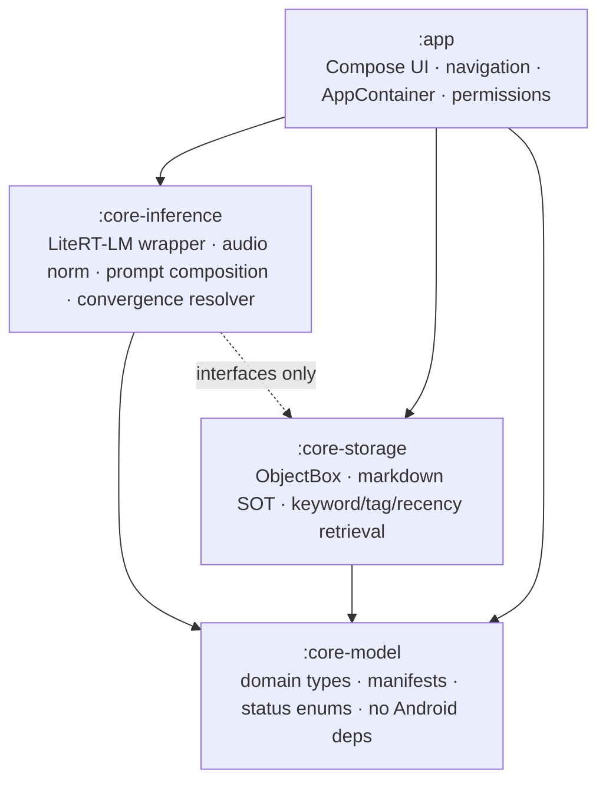
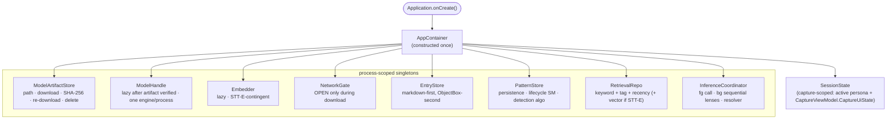
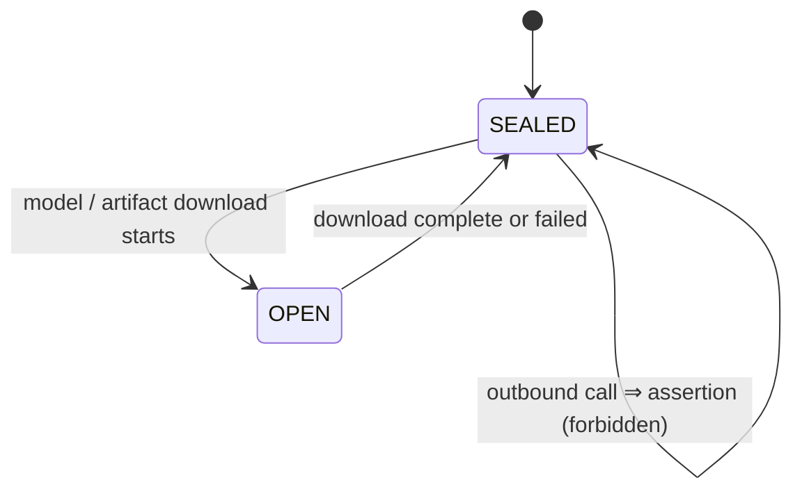
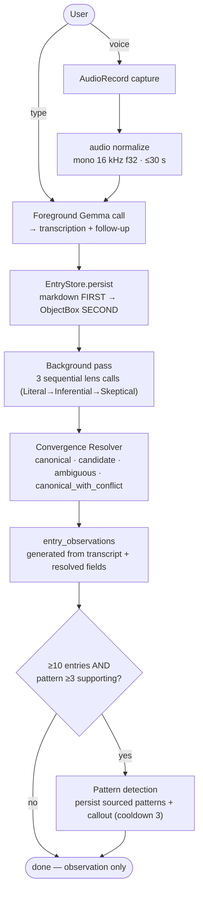

# Architecture

How the components fit together. Source: ADR-001 (stack, module split, `NetworkGate`,
`AppContainer`), `architecture-brief.md` (dataflow, storage contract), ADR-010 (embedder runtime).

---

## 1. Four-module dependency graph

Acyclic, fan-in to `:app`. Core modules never depend on `:app`.

---

## 2. AppContainer — manual constructor DI

One container, constructed once in `Application.onCreate`. No Hilt, no service locator. Process-
scoped singletons; one capture-scoped holder.

---

## 3. NetworkGate — the only HTTP path

Default `SEALED`. `OPEN` exclusively for the model/artifact download, re-sealed the instant it
completes. Any outbound construction outside the gate is grep-blocked in CI (ADR-001 §Q7).

---

## 4. Capture → inference → resolver → storage → patterns

The end-to-end dataflow. `EntryStore` writes **markdown first, ObjectBox second** as one
transactional unit — markdown is the source of truth; a missing ObjectBox row rebuilds from
markdown on next cold start, never the reverse.

