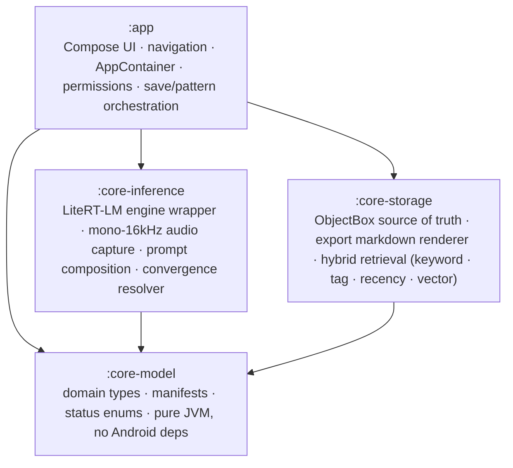
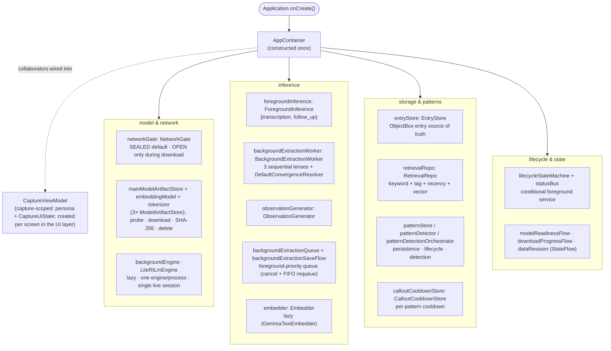
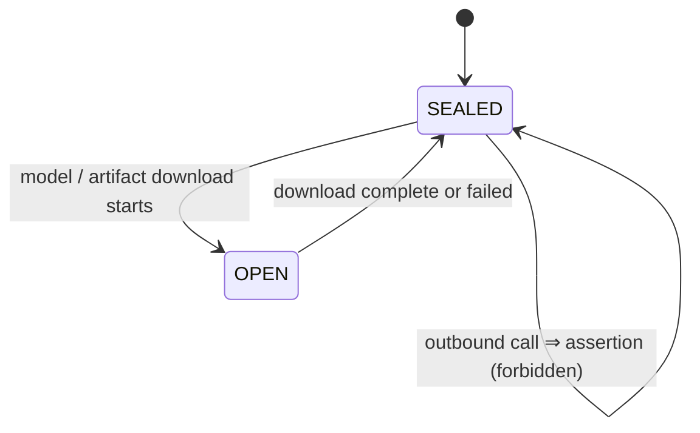
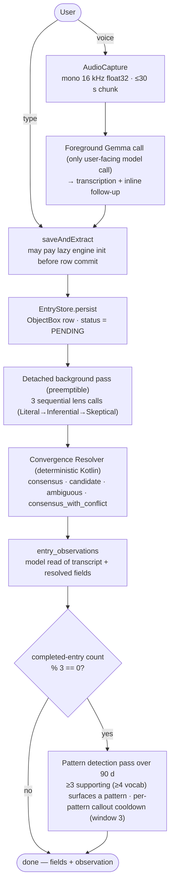

# Architecture

How the components fit together. Source: ADR-001 (stack, module split, `NetworkGate`,
`AppContainer`), `architecture-brief.md` (dataflow, storage contract), ADR-010 (embedder runtime),
ADR-014 (foreground/background split), ADR-017 (ObjectBox as the entry source of truth).

---

## 1. Four-module dependency graph

Acyclic, fan-in to `:app`. Core modules never depend on `:app`, and **`:core-inference` and
`:core-storage` do not depend on each other** — each takes only `api(project(":core-model"))`
(`*/build.gradle.kts`). All inference↔storage orchestration (save flow, pattern detection,
retrieval wiring) lives in `:app` (`AppContainer`).

```mermaid
flowchart TD
    accTitle: Vestige Gradle module dependency graph
    accDescr: app depends on core-inference, core-storage, and core-model. core-inference depends only on core-model. core-storage depends only on core-model. core-model depends on nothing. core-inference and core-storage do not depend on each other.

    App[":app<br/>Compose UI · navigation · AppContainer · permissions · save/pattern orchestration"]
    Inf[":core-inference<br/>LiteRT-LM engine wrapper · mono-16kHz audio capture · prompt composition · convergence resolver"]
    Sto[":core-storage<br/>ObjectBox source of truth · export markdown renderer · hybrid retrieval (keyword · tag · recency · vector)"]
    Mod[":core-model<br/>domain types · manifests · status enums · pure JVM, no Android deps"]

    App --> Inf
    App --> Sto
    App --> Mod
    Inf --> Mod
    Sto --> Mod
```

---

## 2. AppContainer — manual constructor DI

One container, constructed once in `Application.onCreate` (`AppContainer.kt`). No Hilt, no service
locator. Members below are the real fields (lazy unless noted); names match the code. The
capture-scoped `CaptureUiState` is owned by `CaptureViewModel`, created per capture screen —
**not** by `AppContainer`.

```mermaid
flowchart TB
    accTitle: AppContainer composition root
    accDescr: Application onCreate constructs AppContainer once. It holds the NetworkGate and EntryStore eagerly, and lazily builds three ModelArtifactStores (main model plus embedding model plus tokenizer), one backgroundEngine LiteRtLmEngine per process, a lazy Embedder, the foreground and background inference collaborators (ForegroundInference, BackgroundExtractionWorker with DefaultConvergenceResolver, ObservationGenerator), the foreground-priority BackgroundExtractionQueue and BackgroundExtractionSaveFlow, RetrievalRepo, the pattern stack (PatternStore, PatternDetector, PatternDetectionOrchestrator, CalloutCooldownStore), the BackgroundExtractionLifecycleStateMachine and status bus, and readiness/progress StateFlows. CaptureViewModel owns the capture-scoped CaptureUiState and is created outside the container.

    OnCreate(["Application.onCreate()"]) --> AC["AppContainer<br/>(constructed once)"]

    subgraph model["model & network"]
      NG["networkGate: NetworkGate<br/>SEALED default · OPEN only during download"]
      MAS["mainModelArtifactStore + embeddingModel + tokenizer<br/>(3× ModelArtifactStore): probe · download · SHA-256 · delete"]
      ENG["backgroundEngine: LiteRtLmEngine<br/>lazy · one engine/process · single live session"]
    end

    subgraph infer["inference"]
      FI["foregroundInference: ForegroundInference<br/>{transcription, follow_up}"]
      BW["backgroundExtractionWorker: BackgroundExtractionWorker<br/>3 sequential lenses + DefaultConvergenceResolver"]
      OG["observationGenerator: ObservationGenerator"]
      BQ["backgroundExtractionQueue + backgroundExtractionSaveFlow<br/>foreground-priority queue (cancel + FIFO requeue)"]
      EMB["embedder: Embedder<br/>lazy (GemmaTextEmbedder)"]
    end

    subgraph store["storage & patterns"]
      ES["entryStore: EntryStore<br/>ObjectBox entry source of truth"]
      RR["retrievalRepo: RetrievalRepo<br/>keyword + tag + recency + vector"]
      PS["patternStore / patternDetector / patternDetectionOrchestrator<br/>persistence · lifecycle · detection"]
      CC["calloutCooldownStore: CalloutCooldownStore<br/>per-pattern cooldown"]
    end

    subgraph life["lifecycle & state"]
      LSM["lifecycleStateMachine + statusBus<br/>conditional foreground service"]
      SF["modelReadinessFlow · downloadProgressFlow · dataRevision (StateFlow)"]
    end

    AC --> model
    AC --> infer
    AC --> store
    AC --> life
    AC -. collaborators wired into .-> VM["CaptureViewModel<br/>(capture-scoped: persona + CaptureUiState; created per screen in the UI layer)"]
```

---

## 3. NetworkGate — the only HTTP path

Default `SEALED`. `OPEN` exclusively for the model/artifact download, re-sealed the instant it
completes. Any outbound construction outside the gate is grep-blocked in CI (ADR-001 §Q7).

```mermaid
stateDiagram-v2
    accTitle: NetworkGate state machine
    accDescr: NetworkGate starts SEALED. It transitions to OPEN only when a model or artifact download starts, and returns to SEALED the instant the download completes or fails. Any outbound call while SEALED asserts.

    [*] --> SEALED
    SEALED --> OPEN: model / artifact download starts
    OPEN --> SEALED: download complete or failed
    SEALED --> SEALED: outbound call ⇒ assertion (forbidden)
```

---

## 4. Capture → inference → resolver → storage → patterns

The end-to-end dataflow. ObjectBox is the source of truth (ADR-017); export renders markdown from
those rows on demand. Voice foreground is the only user-facing model call (ADR-014), while typed
entries skip foreground inference. Current `saveAndExtract` initializes the shared engine before
creating the pending row, so the first save after lazy startup can still wait on engine init.
Background extraction is detached and is preempted (cancelled + FIFO-requeued) the instant a new
voice foreground capture needs the single engine session (ADR-014 Addendum 2026-05-20).

```mermaid
flowchart TB
    accTitle: End-to-end capture and extraction dataflow
    accDescr: User records or types. Voice is captured by AudioCapture as a mono 16kHz float32 chunk capped at 30 seconds, then a single foreground Gemma call returns transcription and an inline follow-up. Typed entries skip the foreground call, but the save path may initialize the shared engine before EntryStore persists an ObjectBox row marked PENDING. A detached background pass runs three sequential lens calls, the convergence resolver writes consensus, candidate, ambiguous, or consensus_with_conflict fields, entry observations are generated, then on every third completed entry a pattern detection pass runs over the 90-day window. Foreground voice capture preempts in-flight background work.

    U(["User"]) -- voice --> AR["AudioCapture<br/>mono 16 kHz float32 · ≤30 s chunk"]
    U -- type --> INIT["saveAndExtract<br/>may pay lazy engine init before row commit"]
    AR --> FG["Foreground Gemma call (only user-facing model call)<br/>→ transcription + inline follow-up"]
    FG --> INIT
    INIT --> ES["EntryStore.persist<br/>ObjectBox row · status = PENDING"]
    ES --> BG["Detached background pass (preemptible)<br/>3 sequential lens calls (Literal→Inferential→Skeptical)"]
    BG --> CR["Convergence Resolver (deterministic Kotlin)<br/>consensus · candidate · ambiguous · consensus_with_conflict"]
    CR --> OBS["entry_observations<br/>model read of transcript + resolved fields"]
    OBS --> PD{"completed-entry count<br/>% 3 == 0?"}
    PD -- yes --> PAT["Pattern detection pass over 90 d<br/>≥3 supporting (≥4 vocab) surfaces a pattern · per-pattern callout cooldown (window 3)"]
    PD -- no --> Done(["done — fields + observation"])
    PAT --> Done
```
