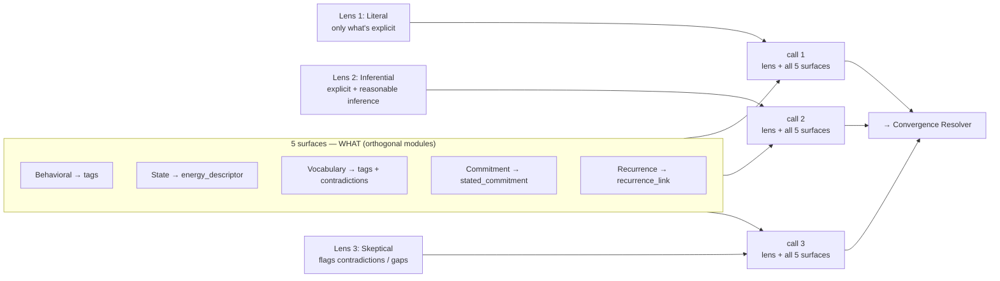
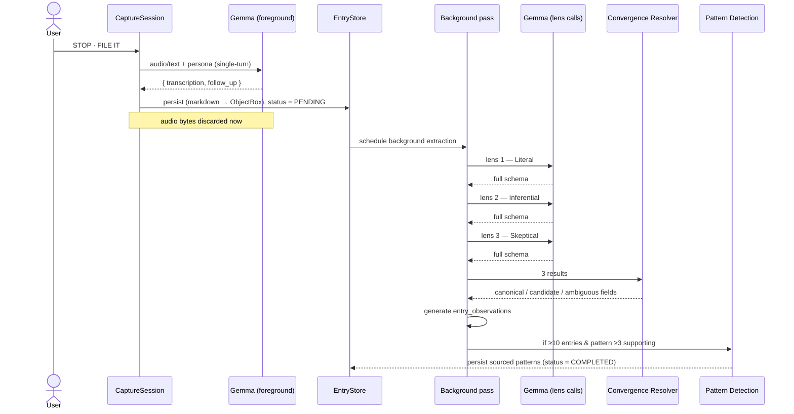
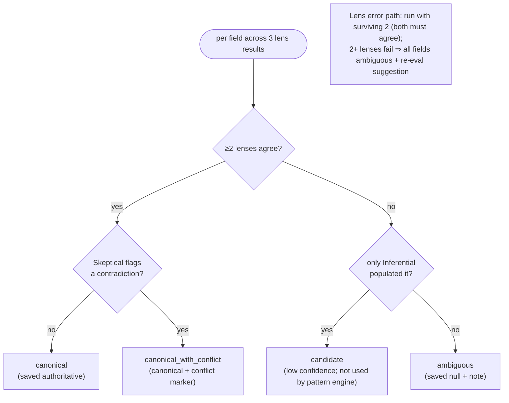
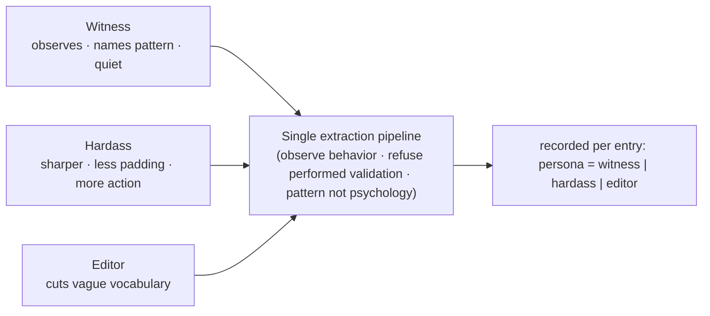
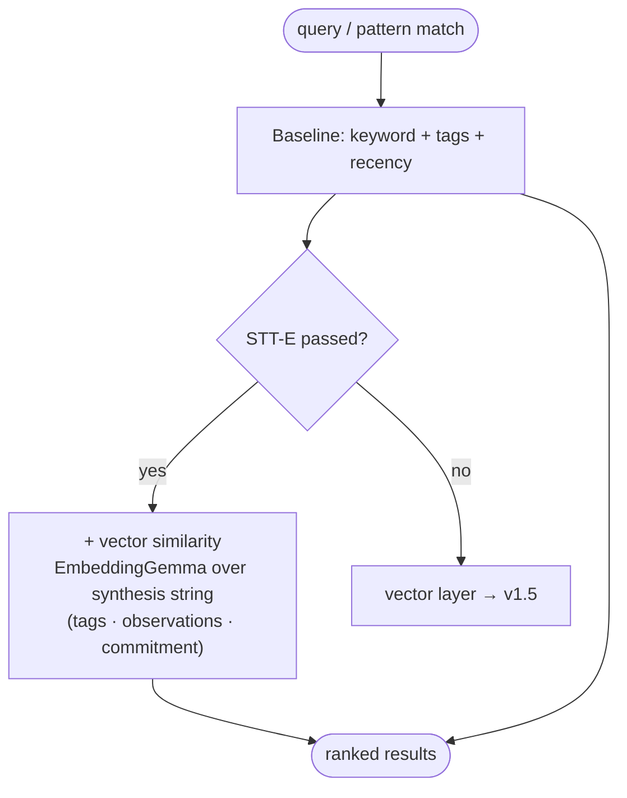

# LLM Functionality

Gemma 4 E4B running on-device via LiteRT-LM. Source: ADR-002 (3-lens × 5-surface, two-tier,
convergence), ADR-005 (single-turn), ADR-008 (concurrent multi-context; v1 sequential pending measurement), ADR-010 (embedder runtime),
`concept-locked.md` (personas, audio, observation layering).

One model artifact (`gemma-4-E4B-it-litert-lm`, 3.66 GB), one `ModelHandle` per process.
Foreground and background inference are **sequential through a single engine behind a `Mutex`** —
recording blocks if a background lens call is running.

---

## 1. 3 lenses × 5 surfaces

5 surfaces = **what** is extracted. 3 lenses = **how** it's framed. Each lens call composes one
lens module with all five surface modules into a single prompt and returns the full schema.
**3 model calls per entry** in the background pass.

---

## 2. Two-tier processing (sequence)

Foreground is fast (transcription + follow-up only, single-turn per ADR-005). Background does the
3-lens convergence over 30–90 s. Audio bytes are discarded immediately after the foreground call.

---

## 3. Convergence resolver — deterministic Kotlin

Not a 4th model call. Per-field agreement predicate decides the verdict.

---

## 4. Personas — tone only

Witness (default) / Hardass / Editor change **prompt + copy**, never extraction logic. The
chosen persona is recorded per entry so old entries keep their original speaker label.

---

## 5. Embeddings & retrieval (STT-E-gated)

P0 retrieval is keyword + Gemma-extracted tags + recency. The semantic vector layer
(EmbeddingGemma 300M via LiteRT, loaded through `GemmaEmbeddingModel` / `localagents-rag` — a
separate native `.so` from `ModelHandle`) ships **only if STT-E passes**; otherwise it drops to
v1.5. The embedding target is a post-convergence **synthesis string** (tags + observations +
commitment), not the raw transcription.

