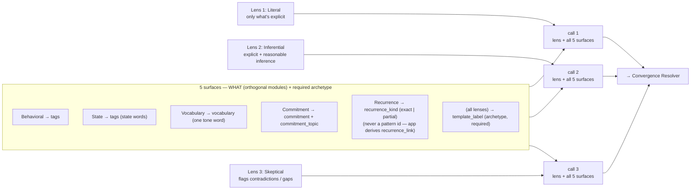
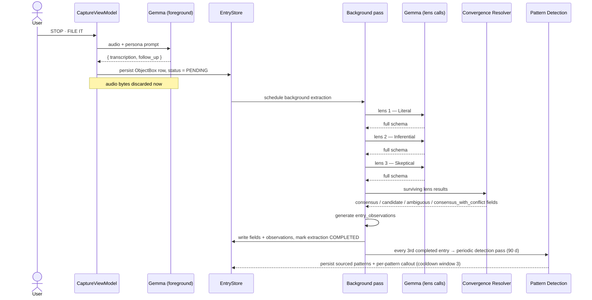
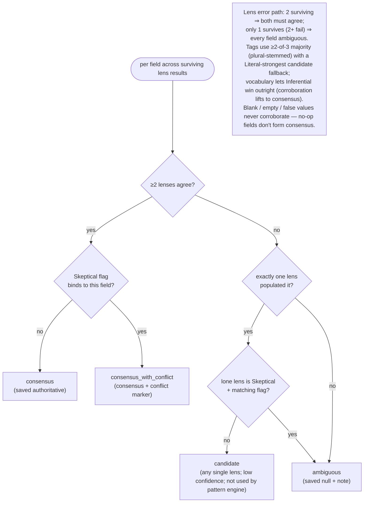
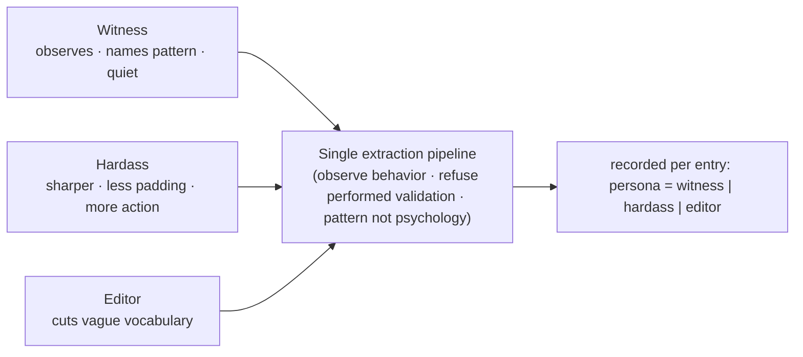
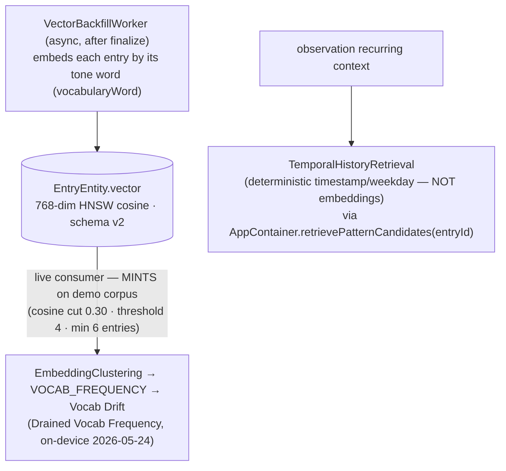
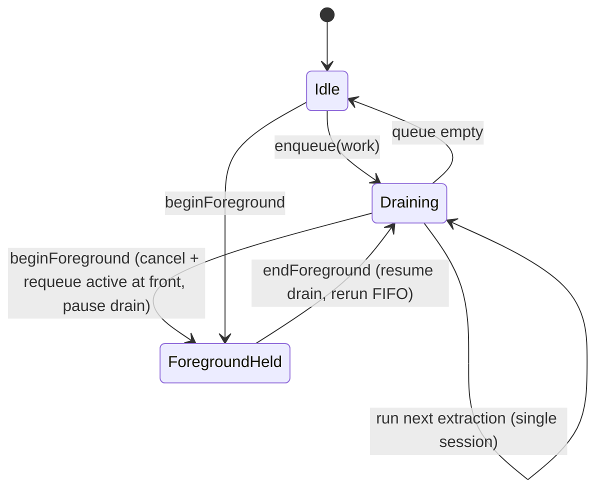

# LLM Functionality

Gemma 4 E4B running on-device via LiteRT-LM. Source: ADR-002 (3-lens × 5-surface, two-tier,
convergence), ADR-005 (single-turn), ADR-008 (**concurrent multi-context REVERSED 2026-05-17** —
`litertlm-android:0.11.0` is single-session, so sequential 3-lens is the runtime ceiling, not a
scope choice), ADR-014 (foreground/background split + periodic pattern analysis), ADR-018 (inline
foreground follow-up), ADR-010 (embedder runtime), `concept-locked.md` (personas, audio,
observation layering).

One model artifact (`gemma-4-E4B-it-litert-lm`, 3.66 GB), one `backgroundEngine` (`LiteRtLmEngine`)
per process holding **one live session at a time** (`callMutex`; a second concurrent
`createConversation` throws `FAILED_PRECONDITION` — STT-F). Foreground capture does **not** wait
behind background extraction: it **preempts** by cancelling the in-flight background lens, leaving
the row non-terminal, and requeuing the work FIFO after the foreground call releases the session
(ADR-014 Addendum 2026-05-20).

---

## 1. 3 lenses × 5 surfaces

5 surfaces = **what** is extracted. 3 lenses = **how** it's framed. Each lens call composes one
lens module with all five surface modules into a single prompt and returns the full schema
(`PromptComposer.kt`, `resources/surfaces/*.txt`, `resources/lenses/output-schema.txt`). **3 model
calls per entry** in the background pass. Field names below are the **emitted schema** keys, not the
internal resolved-field keys: `recurrence_kind` is the surface output (the app derives the
`recurrence_link` / `pattern_id` afterward), and the model emits `commitment` + `commitment_topic`
(persisted as `stated_commitment`). `template_label` is a required cross-cutting field every lens
emits — the archetype (one of `aftermath` / `tunnel-exit` / `stalled` / `decision-spiral` /
`goblin-hours` / `audit`).

```mermaid
flowchart LR
    accTitle: Three lenses by five surfaces extraction matrix
    accDescr: Each of three lenses (Literal, Inferential, Skeptical) is one model call that composes all five surfaces (Behavioral, State, Vocabulary, Commitment, Recurrence) plus the required template_label archetype, and returns the full plain-text schema. Three model calls per entry. Behavioral and State both write tags; Vocabulary writes the one-word tone; Commitment writes commitment and commitment_topic; Recurrence writes recurrence_kind exact or partial and never a pattern id.

    subgraph surfaces["5 surfaces — WHAT (orthogonal modules) + required archetype"]
      direction TB
      B["Behavioral → tags"]
      S["State → tags (state words)"]
      V["Vocabulary → vocabulary (one tone word)"]
      C["Commitment → commitment + commitment_topic"]
      R["Recurrence → recurrence_kind (exact | partial)<br/>(never a pattern id — app derives recurrence_link)"]
      T["(all lenses) → template_label (archetype, required)"]
    end

    L1["Lens 1: Literal<br/>only what's explicit"] --> P1["call 1<br/>lens + all 5 surfaces"]
    L2["Lens 2: Inferential<br/>explicit + reasonable inference"] --> P2["call 2<br/>lens + all 5 surfaces"]
    L3["Lens 3: Skeptical<br/>flags contradictions / gaps"] --> P3["call 3<br/>lens + all 5 surfaces"]

    surfaces --> P1
    surfaces --> P2
    surfaces --> P3
    P1 --> RES["→ Convergence Resolver"]
    P2 --> RES
    P3 --> RES
```

---

## 2. Two-tier processing (sequence)

Foreground is fast (transcription + one inline follow-up). Background runs the 3-lens convergence
sequentially — measured on the reference S24 Ultra (GPU, E4B): ≈14.7 s per lens, ≈44 s for the full
3-lens pass, inside the documented 25–55 s band (ADR-008 §Addendum 2026-05-17, STT-F). Audio bytes
are discarded immediately after the foreground call.

```mermaid
sequenceDiagram
    accTitle: Two-tier foreground and background inference sequence
    accDescr: User stops recording. The foreground Gemma call returns transcription and one inline follow-up. EntryStore persists an ObjectBox row and marks extraction PENDING. The detached background pass runs three sequential lens calls, the resolver writes fields, entry observations are generated, the entry is marked COMPLETED, then on every third completed entry a periodic pattern detection pass runs over the 90-day window.

    actor U as User
    participant Cap as CaptureViewModel
    participant FG as Gemma (foreground)
    participant ES as EntryStore
    participant BG as Background pass
    participant LM as Gemma (lens calls)
    participant CR as Convergence Resolver
    participant PD as Pattern Detection

    U->>Cap: STOP · FILE IT
    Cap->>FG: audio + persona prompt
    FG-->>Cap: { transcription, follow_up }
    Cap->>ES: persist ObjectBox row, status = PENDING
    Note over FG,Cap: audio bytes discarded now
    ES->>BG: schedule background extraction
    BG->>LM: lens 1 — Literal
    LM-->>BG: full schema
    BG->>LM: lens 2 — Inferential
    LM-->>BG: full schema
    BG->>LM: lens 3 — Skeptical
    LM-->>BG: full schema
    BG->>CR: surviving lens results
    CR-->>BG: consensus / candidate / ambiguous / consensus_with_conflict fields
    BG->>BG: generate entry_observations
    BG->>ES: write fields + observations, mark extraction COMPLETED
    BG->>PD: every 3rd completed entry → periodic detection pass (90 d)
    PD-->>ES: persist sourced patterns + per-pattern callout (cooldown window 3)
```

---

## 3. Convergence resolver — deterministic Kotlin

Not a 4th model call. Per-field agreement predicate decides the verdict.

```mermaid
flowchart TD
    accTitle: Convergence resolver per-field decision
    accDescr: For each field, if two or more of three lenses agree the verdict is consensus, unless a Skeptical flag binds to that field in which case it is consensus_with_conflict. If exactly one lens populated the field the verdict is candidate (any single lens, not specifically Inferential), except a lone Skeptical carrying a matching flag resolves to ambiguous. If lenses disagree the verdict is ambiguous and the field is saved null with a lens-disagreement note.

    F(["per field across surviving lens results"]) --> A{"≥2 lenses agree?"}
    A -- yes --> SK{"Skeptical flag<br/>binds to this field?"}
    SK -- no --> CON["consensus<br/>(saved authoritative)"]
    SK -- yes --> CWC["consensus_with_conflict<br/>(consensus + conflict marker)"]
    A -- no --> ONE{"exactly one lens<br/>populated it?"}
    ONE -- yes --> SKQ{"lone lens is Skeptical<br/>+ matching flag?"}
    SKQ -- no --> CND["candidate<br/>(any single lens; low confidence; not used by pattern engine)"]
    SKQ -- yes --> AMB["ambiguous<br/>(saved null + note)"]
    ONE -- no --> AMB

    note["Lens error path: 2 surviving ⇒ both must agree;<br/>only 1 survives (2+ fail) ⇒ every field ambiguous.<br/>Tags use ≥2-of-3 majority (plural-stemmed) with a Literal-strongest candidate fallback;<br/>vocabulary lets Inferential win outright (corroboration lifts to consensus).<br/>Blank / empty / false values never corroborate — no-op fields don't form consensus."]
```

---

## 4. Personas — tone only

Witness (default) / Hardass / Editor change **prompt + copy**, never extraction logic. The
chosen persona is recorded per entry so old entries keep their original speaker label.

```mermaid
flowchart LR
    accTitle: Personas are tone-only variants
    accDescr: One extraction pipeline. Witness, Hardass, and Editor are three prompt-and-copy tone variants feeding the same foreground and background logic. Persona is recorded per entry.

    Logic["Single extraction pipeline<br/>(observe behavior · refuse performed validation · pattern not psychology)"]
    W["Witness<br/>observes · names pattern · quiet"] --> Logic
    H["Hardass<br/>sharper · less padding · more action"] --> Logic
    E["Editor<br/>cuts vague vocabulary"] --> Logic
    Logic --> Rec["recorded per entry: persona = witness | hardass | editor"]
```

---

## 5. Embeddings: the live Vocab Drift surface

EmbeddingGemma 300M is shipped and **not STT-E-gated** (STT-E is an on-device measurement harness,
`SttEEmbeddingComparisonTest`, not a runtime switch). It loads through `GemmaEmbeddingModel` /
`localagents-rag` (a self-contained `.so`, separate from the Gemma engine; ADR-010).
`VectorBackfillWorker` embeds each entry by its model-emitted **tone word** (`vocabularyWord`) into
`EntryEntity.vector` (768-dim HNSW cosine), **not** the raw transcription. The embedding axis is the
felt quality of the entry, not its content — which is why a content query can't score against it.

- **Clustering (`EmbeddingClustering` → `VOCAB_FREQUENCY` → Vocab Drift screen)** is the live
  consumer and **mints on the demo corpus**: with the cosine cut `DEFAULT_MAX_COSINE_DISTANCE = 0.30`,
  the `VOCAB_THRESHOLD = 4` floor, and `MIN_SUPPORTING_ENTRIES = 6`, related tone words cluster into
  the `Drained Vocab Frequency` pattern (verified on-device 2026-05-24). Vectors carry
  `CURRENT_VECTOR_SCHEMA_VERSION = 2`.
- **Deterministic recurring context** uses `TemporalHistoryRetrieval` (timestamp/weekday) via
  `AppContainer.retrievePatternCandidates(entryId): List<HistoryChunk>` — the only deterministic
  history helper that exists. The earlier ranked content-retrieval path (`RetrievalRepo` — keyword +
  tag + recency + cosine) was **cut** when the embedding axis moved to the tone word: a content query
  can't score against a feeling vector. No `.kt` references to it remain.

```mermaid
flowchart TD
    accTitle: Embeddings power the live Vocab Drift surface
    accDescr: VectorBackfillWorker embeds each entry by its model-emitted tone word into a 768-dimension vector after the entry finalizes. EmbeddingClustering is the live consumer for the VOCAB_FREQUENCY pattern and the Vocab Drift screen, and it mints on the demo corpus as the Drained Vocab Frequency pattern verified on-device, using a 0.30 cosine cut, a vocab threshold of 4, and a minimum of 6 supporting entries. Separately, the observation recurring context uses deterministic timestamp and weekday based TemporalHistoryRetrieval via AppContainer.retrievePatternCandidates, the only deterministic history helper that exists.

    BF["VectorBackfillWorker (async, after finalize)<br/>embeds each entry by its tone word (vocabularyWord)"] --> VEC[("EntryEntity.vector<br/>768-dim HNSW cosine · schema v2")]
    VEC -- "live consumer — MINTS on demo corpus<br/>(cosine cut 0.30 · threshold 4 · min 6 entries)" --> CL["EmbeddingClustering → VOCAB_FREQUENCY → Vocab Drift<br/>(Drained Vocab Frequency, on-device 2026-05-24)"]
    OBS["observation recurring context"] --> TH["TemporalHistoryRetrieval<br/>(deterministic timestamp/weekday — NOT embeddings)<br/>via AppContainer.retrievePatternCandidates(entryId)"]
```

---

## 6. Foreground-priority inference queue (single session)

Both the foreground call and the background lens passes share **one** engine that holds **one live
session** (`callMutex`). To keep capture from waiting behind extraction (ADR-008 reversal + ADR-014
Addendum 2026-05-20), `BackgroundExtractionQueue` lets foreground **preempt**: `beginForeground`
cancels the in-flight extraction (leaving its row non-terminal) and pushes it back to the **front**
of the queue; while `foregroundDepth > 0` the drain is paused; `endForeground` restarts the drain so
the requeued work reruns FIFO. Cancelled extraction is discard-and-rerun at the unit-of-work
boundary — not KV-cache suspend/resume.

```mermaid
stateDiagram-v2
    accTitle: Foreground-priority background extraction queue
    accDescr: The queue idles when empty. Enqueuing work starts draining, which runs background extractions one at a time against the single engine session. When a foreground capture begins, the active extraction is cancelled and requeued at the front and draining pauses until the foreground call ends, after which draining resumes and reruns the requeued work in FIFO order. Cancel-all clears the queue.

    [*] --> Idle
    Idle --> Draining: enqueue(work)
    Draining --> Draining: run next extraction (single session)
    Draining --> Idle: queue empty
    Draining --> ForegroundHeld: beginForeground (cancel + requeue active at front, pause drain)
    Idle --> ForegroundHeld: beginForeground
    ForegroundHeld --> Draining: endForeground (resume drain, rerun FIFO)
```
