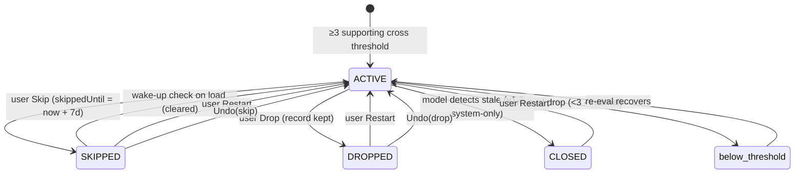
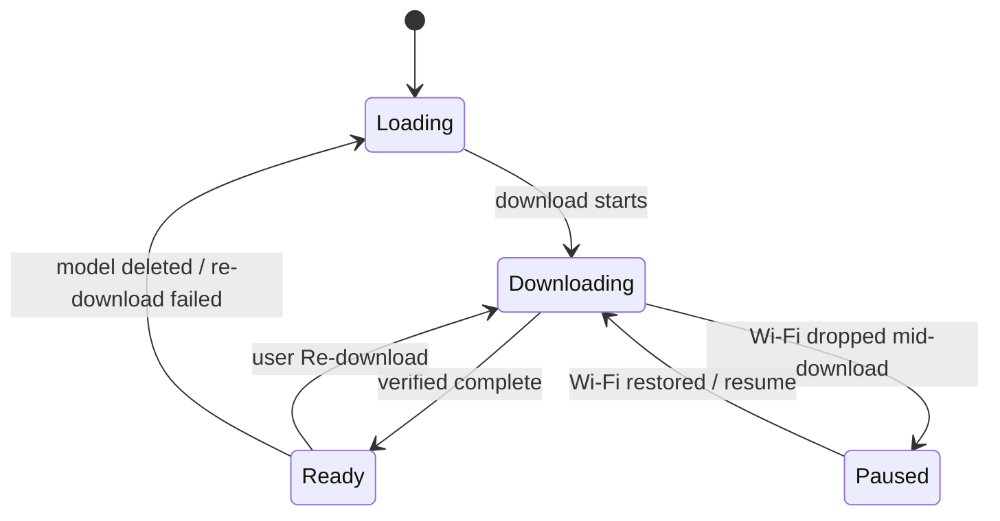
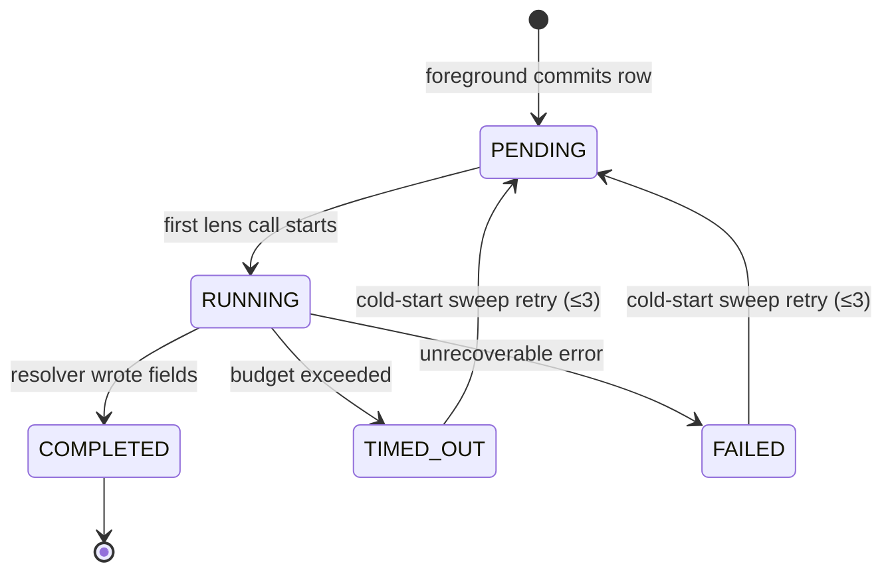

# State Diagrams

The finite-state machines in the system, as written. Source: `CaptureViewModel.CaptureUiState`
(capture; ADR-001 §Q8 + ADR-005 §Addendum 2026-05-17), ADR-001 (extraction_status), ADR-003 +
2026-05-13/13b addenda (pattern lifecycle), ADR-004 + ADR-007 (foreground service),
`ux-copy.md` (ModelReadiness, onboarding download phases).

---

## 1. Capture (`CaptureViewModel.CaptureUiState`)

The live single-capture FSM, owned by `CaptureViewModel` over the `ForegroundStreamEvent`
stream (it superseded the retired `CaptureSession`; ADR-005 §Addendum 2026-05-17). v1
single-turn (ADR-005): one USER turn + one MODEL follow-up. Discard during `Recording` is a
synchronous return to `Idle` — no Gemma call, no entry, no rehydration (ADR-001 §Q8). Errors
surface as a `CaptureError` on `Idle`, not a terminal state. `Idle` is the only resting state;
`Reviewing` self-transitions when the terminal stream event clears the streaming gate, after
which Done (acknowledge) is allowed.

```mermaid
stateDiagram-v2
    accTitle: Capture UI state machine (CaptureViewModel.CaptureUiState)
    accDescr: Idle transitions to Recording on tap Record when the model is Ready. From Recording, discard or no captured audio returns to Idle with no entry; captured audio moves to Inferring. Inferring moves to Reviewing on the first stream event (streaming gate open), or back to Idle with a CaptureError if inference fails. Reviewing self-transitions when the terminal event clears the streaming gate, enabling Done, which acknowledges and returns to Idle. Idle is the only resting state; there are no terminal states.

    [*] --> Idle
    Idle --> Recording: tap Record (model Ready)
    Recording --> Idle: discard / no audio
    Recording --> Inferring: audio captured
    Inferring --> Reviewing: first stream event (streaming)
    Inferring --> Idle: inference error (CaptureError)
    Reviewing --> Reviewing: terminal event clears streaming gate
    Reviewing --> Idle: Done (acknowledge; only after terminal)
```

---

## 2. Pattern lifecycle

`PatternState` = `ACTIVE` / `SKIPPED` / `CLOSED` / `DROPPED` (`below_threshold` is an internal
re-eval drop, not user-visible; no pattern object exists until ≥10 entries and ≥3 supporting).
**User** actions: Skip / Drop / Restart. **System**: snooze wake-up, re-eval, model-detected
close (v1.5). Undo restores the exact pre-action snapshot (including original `skippedUntil`).

---

## 3. ModelReadiness

Exactly **four** runtime states. `Stalled` / `Failed` / `Updating` are display labels on the
status screen, **not** runtime states. A failed re-download falls back to `Loading`.

---

## 4. Onboarding download phases (Screen 3)

The download surface on onboarding Screen 3. `Reacquiring` is the **automatic** post-SHA-mismatch
re-pull — no tap required.

```mermaid
stateDiagram-v2
    accTitle: Onboarding model-download phase machine
    accDescr: Active shows bytes and ETA. It can go to Stalled with a Retry button, Failed with a Try again button, or Reacquiring which auto re-downloads after a SHA mismatch with no tap. All recover to Active. On completion it auto-returns to the Wiring hub; if restored without Wi-Fi it also returns to Wiring.

    [*] --> Active: download running (bytes / ETA)
    Active --> Stalled: no progress → "Download stalled." + Retry
    Active --> Failed: error → "Network choked." + Try again
    Active --> Reacquiring: SHA mismatch → auto re-download (no tap)
    Stalled --> Active: Retry
    Failed --> Active: Try again
    Reacquiring --> Active: re-pull resumes
    Active --> Complete: verified
    Complete --> [*]: auto-return to Wiring hub
```

---

## 5. Background extraction status (ADR-001 §Q3)

Operational `extraction_status` enum (ObjectBox-only — never written to markdown; a markdown-only
rebuild is `COMPLETED`). Carries `attempt_count` (cap 3) and `last_error`. Cold-start sweep
re-runs `PENDING` / `RUNNING`.

---

## 6. Foreground service lifecycle (ADR-004 + ADR-007)

Five baseline states (ADR-004) plus three ADR-007 failure pathways. Restart policy is
`START_NOT_STICKY` (ADR-006); crash recovery flows through the cold-start sweep, not service
stickiness.

```mermaid
stateDiagram-v2
    accTitle: Conditional foreground service lifecycle with failure pathways
    accDescr: NORMAL promotes to PROMOTING on first RUNNING extraction, then FOREGROUND on startForeground success. FOREGROUND moves to KEEP_ALIVE when the last in-flight extraction terminates, with a 30-second window; new work returns it to FOREGROUND, otherwise it goes to DEMOTING then NORMAL. ADR-007 adds: DEMOTING back to PROMOTING if work arrives during demote; PROMOTING retry via NORMAL on start failure with a single 5-second bounded retry; any active state back to PROMOTING on an OS service kill.

    [*] --> NORMAL
    NORMAL --> PROMOTING: first extraction → RUNNING
    PROMOTING --> FOREGROUND: startForeground() ok
    FOREGROUND --> FOREGROUND: next extraction → RUNNING
    FOREGROUND --> KEEP_ALIVE: last in-flight terminal
    KEEP_ALIVE --> FOREGROUND: new RUNNING in 30s window
    KEEP_ALIVE --> DEMOTING: 30s keep-alive expires
    DEMOTING --> NORMAL: stopForeground() + stopSelf()
    DEMOTING --> PROMOTING: work arrived during demote (ADR-007)
    PROMOTING --> NORMAL: startForeground failed → 5s bounded retry (ADR-007)
    FOREGROUND --> PROMOTING: OS service kill → onServiceKilled (ADR-007)
    KEEP_ALIVE --> PROMOTING: OS service kill → onServiceKilled (ADR-007)
    DEMOTING --> PROMOTING: OS service kill → onServiceKilled (ADR-007)
```

