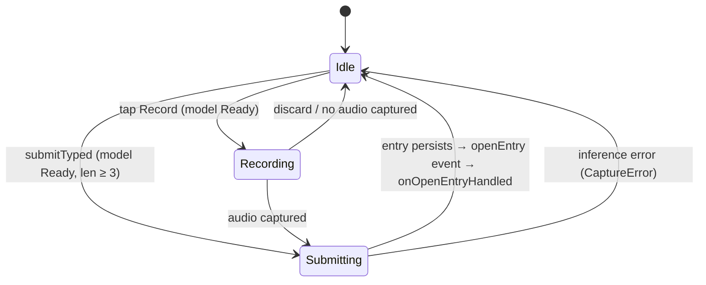
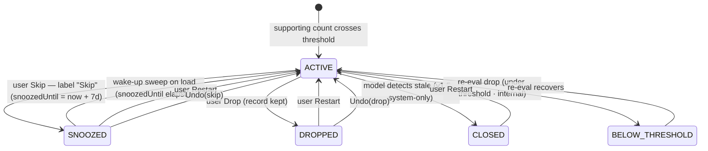
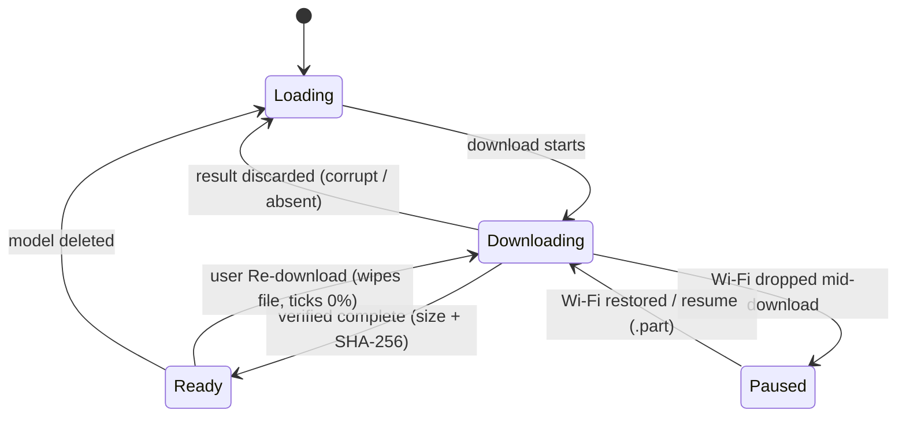
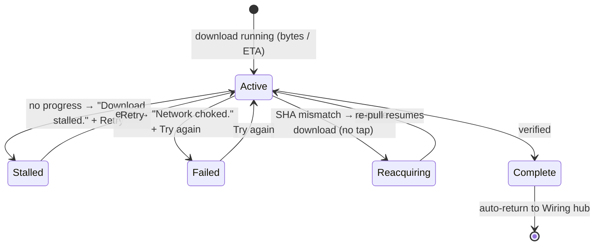
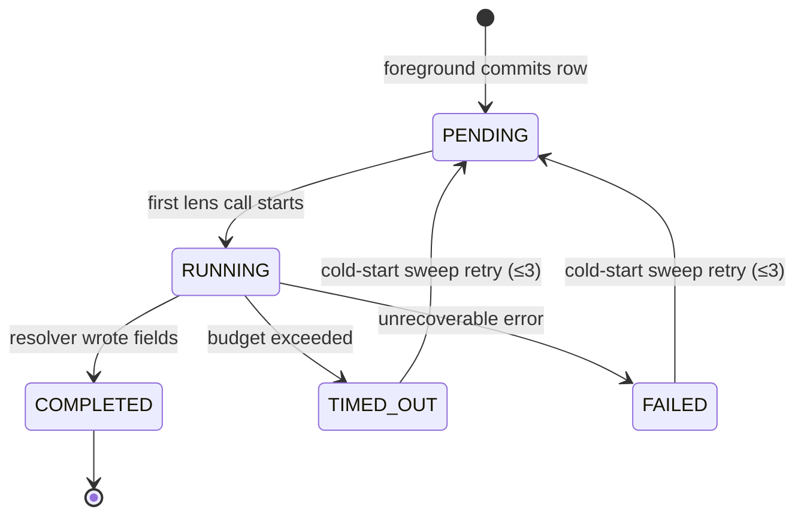
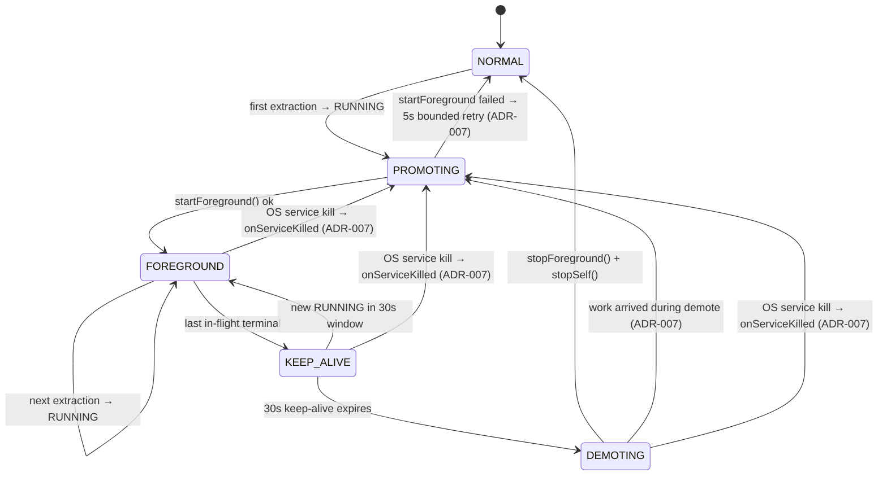

# State Diagrams

The finite-state machines in the system, as written. Source: `CaptureViewModel.CaptureUiState`
(capture; ADR-001 §Q8 + ADR-005 §Addendum 2026-05-17), ADR-001 (extraction_status), ADR-003 +
2026-05-13/13b addenda (pattern lifecycle), ADR-004 + ADR-007 (foreground service),
`ux-copy.md` (ModelReadiness, onboarding download phases).

---

## 1. Capture (`CaptureViewModel.CaptureUiState`)

Three phases, owned by `CaptureViewModel` (`CaptureUiState.kt`). There is **no** in-Capture
review/inferring surface: once call-1 transcription returns and the entry persists, the host is
told to open it in History detail (which renders its own `extracting → resolved` states off
`extractionStatus`), and Capture resets to `Idle` only after the route confirms it consumed the
open event (ADR-018; ADR-014 Addendum 2026-05-18). `Submitting` is the transient spinner between
STOP / typed-submit and the entry persisting. Discard during `Recording` is a synchronous return
to `Idle` — no Gemma call, no entry. Both record-start and typed-submit are gated on
`ModelReadiness == Ready` (ADR-013). Errors surface as a `CaptureError` on `Idle`, not a terminal
state. `Idle` is the only resting state.

```mermaid
stateDiagram-v2
    accTitle: Capture UI state machine (CaptureViewModel.CaptureUiState)
    accDescr: Idle has three exits. tap Record (model Ready) goes to Recording; submitTyped (model Ready, text at least 3 chars) goes to Submitting. From Recording, discard or no captured audio returns to Idle with no entry; captured audio moves to Submitting. Submitting persists the entry then fires an openEntry event so the host opens History detail, and the VM resets to Idle once that event is handled; an inference error returns to Idle carrying a CaptureError. Idle is the only resting state; there are no terminal states.

    [*] --> Idle
    Idle --> Recording: tap Record (model Ready)
    Idle --> Submitting: submitTyped (model Ready, len ≥ 3)
    Recording --> Idle: discard / no audio captured
    Recording --> Submitting: audio captured
    Submitting --> Idle: entry persists → openEntry event → onOpenEntryHandled
    Submitting --> Idle: inference error (CaptureError)
```

---

## 2. Pattern lifecycle

`PatternState` (enum constants) = `ACTIVE` / `SNOOZED` / `DROPPED` / `CLOSED` / `BELOW_THRESHOLD`
(serials `active` / `snoozed` / `dismissed` / `resolved` / `below_threshold` — kept at pre-rename
values so no ObjectBox migration is needed). `SNOOZED` carries the user **Skip** semantic; the
user-facing label is "Skip" while the persisted state stays `SNOOZED` and the field is
`snoozedUntil` (`PatternState.kt`, `PatternEntity.kt`). `BELOW_THRESHOLD` is an internal re-eval
drop, never user-visible; no pattern object exists until a kind crosses its threshold (≥3
supporting, ≥4 for vocab). **User** actions: Skip / Drop / Restart. **System**: snooze wake-up,
re-eval, model-detected close (v1.5). Undo restores the exact pre-action snapshot (including the
original `snoozedUntil`).

```mermaid
stateDiagram-v2
    accTitle: Pattern lifecycle state machine
    accDescr: A pattern becomes ACTIVE when supporting entries cross threshold. The user can Skip it to SNOOZED (UI label "Skip") with a 7-day wake-up, or Drop it to DROPPED keeping the record. SNOOZED auto-returns to ACTIVE on the cold-start wake-up check. The user can Restart SNOOZED, DROPPED, or CLOSED back to ACTIVE. The model can detect staleness and move ACTIVE to CLOSED (v1.5, no user action). Re-eval can drop ACTIVE to internal BELOW_THRESHOLD and back.

    [*] --> ACTIVE: supporting count crosses threshold
    ACTIVE --> SNOOZED: user Skip — label "Skip" (snoozedUntil = now + 7d)
    ACTIVE --> DROPPED: user Drop (record kept)
    ACTIVE --> CLOSED: model detects stale (v1.5 · system-only)
    ACTIVE --> BELOW_THRESHOLD: re-eval drop (under threshold · internal)
    BELOW_THRESHOLD --> ACTIVE: re-eval recovers
    SNOOZED --> ACTIVE: wake-up sweep on load (snoozedUntil elapsed)
    SNOOZED --> ACTIVE: user Restart
    DROPPED --> ACTIVE: user Restart
    CLOSED --> ACTIVE: user Restart
    SNOOZED --> ACTIVE: Undo(skip)
    DROPPED --> ACTIVE: Undo(drop)
```

---

## 3. ModelReadiness

Exactly **four** runtime states (`ModelReadiness` in `CaptureUiState.kt`: `Loading` / `Downloading(percent)`
/ `Ready` / `Paused`). `Stalled` / `Failed` / `Updating` are display labels on the status screen,
**not** runtime states. Readiness is artifact-presence based: a full-size artifact that passes the
SHA-256 check is `Ready`; the engine loads lazily on the first inference (ADR-012 §Addendum:
proactive pre-warm reverted after it regressed into a startup GPU-init crash). A re-download first
wipes the artifact and ticks `Downloading(0)`; if it fails it lands on `Paused` when a resumable
`.part` survives, or `Loading` when nothing usable remains (corrupt result discarded / `Absent`)
(`AppContainer.probeModelReadiness`).

```mermaid
stateDiagram-v2
    accTitle: ModelReadiness runtime state machine
    accDescr: Four runtime states. Loading transitions to Downloading when a download starts. Downloading goes to Ready when the artifact is verified complete, or Paused if Wi-Fi drops mid-download. Paused resumes to Downloading. A user Re-download moves Ready to Downloading; a failed re-download resolves to Paused (resumable part file) or Loading (nothing usable). Deleting the model returns Ready to Loading.

    [*] --> Loading
    Loading --> Downloading: download starts
    Downloading --> Ready: verified complete (size + SHA-256)
    Downloading --> Paused: Wi-Fi dropped mid-download
    Downloading --> Loading: result discarded (corrupt / absent)
    Paused --> Downloading: Wi-Fi restored / resume (.part)
    Ready --> Downloading: user Re-download (wipes file, ticks 0%)
    Ready --> Loading: model deleted
```

---

## 4. Onboarding download phases (Screen 3)

The download surface on onboarding Screen 3. `Reacquiring` is the **automatic** post-SHA-mismatch
re-pull — no tap required.

```mermaid
stateDiagram-v2
    accTitle: Onboarding model-download phase machine
    accDescr: Active shows bytes and ETA. It can go to Stalled with a Retry button, Failed with a Try again button, or Reacquiring which auto re-downloads after a SHA mismatch with no tap. All recover to Active. On completion it auto-returns to the Wiring hub; if restored without Wi-Fi it also returns to Wiring.

    [*] --> Active: download running (bytes / ETA)
    Active --> Stalled: no progress → "Download stalled." + Retry
    Active --> Failed: error → "Network choked." + Try again
    Active --> Reacquiring: SHA mismatch → auto re-download (no tap)
    Stalled --> Active: Retry
    Failed --> Active: Try again
    Reacquiring --> Active: re-pull resumes
    Active --> Complete: verified
    Complete --> [*]: auto-return to Wiring hub
```

---

## 5. Background extraction status (ADR-001 §Q3)

Operational `extraction_status` enum (ObjectBox-only — never written to markdown; a markdown-only
rebuild is `COMPLETED`). Carries `attempt_count` (cap 3) and `last_error`. Cold-start sweep
re-runs `PENDING` / `RUNNING`.

```mermaid
stateDiagram-v2
    accTitle: Background extraction status machine
    accDescr: An entry is committed PENDING before the user sees the follow-up. The background pass flips it to RUNNING on the first lens call, then to a terminal COMPLETED, TIMED_OUT, or FAILED after the resolver. The cold-start sweep re-runs PENDING or RUNNING entries up to attempt_count cap 3.

    [*] --> PENDING: foreground commits row
    PENDING --> RUNNING: first lens call starts
    RUNNING --> COMPLETED: resolver wrote fields
    RUNNING --> TIMED_OUT: budget exceeded
    RUNNING --> FAILED: unrecoverable error
    TIMED_OUT --> PENDING: cold-start sweep retry (≤3)
    FAILED --> PENDING: cold-start sweep retry (≤3)
    COMPLETED --> [*]
```

---

## 6. Foreground service lifecycle (ADR-004 + ADR-007)

Five baseline states (ADR-004) plus three ADR-007 failure pathways. Restart policy is
`START_NOT_STICKY` (ADR-006); crash recovery flows through the cold-start sweep, not service
stickiness.

```mermaid
stateDiagram-v2
    accTitle: Conditional foreground service lifecycle with failure pathways
    accDescr: NORMAL promotes to PROMOTING on first RUNNING extraction, then FOREGROUND on startForeground success. FOREGROUND moves to KEEP_ALIVE when the last in-flight extraction terminates, with a 30-second window; new work returns it to FOREGROUND, otherwise it goes to DEMOTING then NORMAL. ADR-007 adds: DEMOTING back to PROMOTING if work arrives during demote; PROMOTING retry via NORMAL on start failure with a single 5-second bounded retry; any active state back to PROMOTING on an OS service kill.

    [*] --> NORMAL
    NORMAL --> PROMOTING: first extraction → RUNNING
    PROMOTING --> FOREGROUND: startForeground() ok
    FOREGROUND --> FOREGROUND: next extraction → RUNNING
    FOREGROUND --> KEEP_ALIVE: last in-flight terminal
    KEEP_ALIVE --> FOREGROUND: new RUNNING in 30s window
    KEEP_ALIVE --> DEMOTING: 30s keep-alive expires
    DEMOTING --> NORMAL: stopForeground() + stopSelf()
    DEMOTING --> PROMOTING: work arrived during demote (ADR-007)
    PROMOTING --> NORMAL: startForeground failed → 5s bounded retry (ADR-007)
    FOREGROUND --> PROMOTING: OS service kill → onServiceKilled (ADR-007)
    KEEP_ALIVE --> PROMOTING: OS service kill → onServiceKilled (ADR-007)
    DEMOTING --> PROMOTING: OS service kill → onServiceKilled (ADR-007)
```
