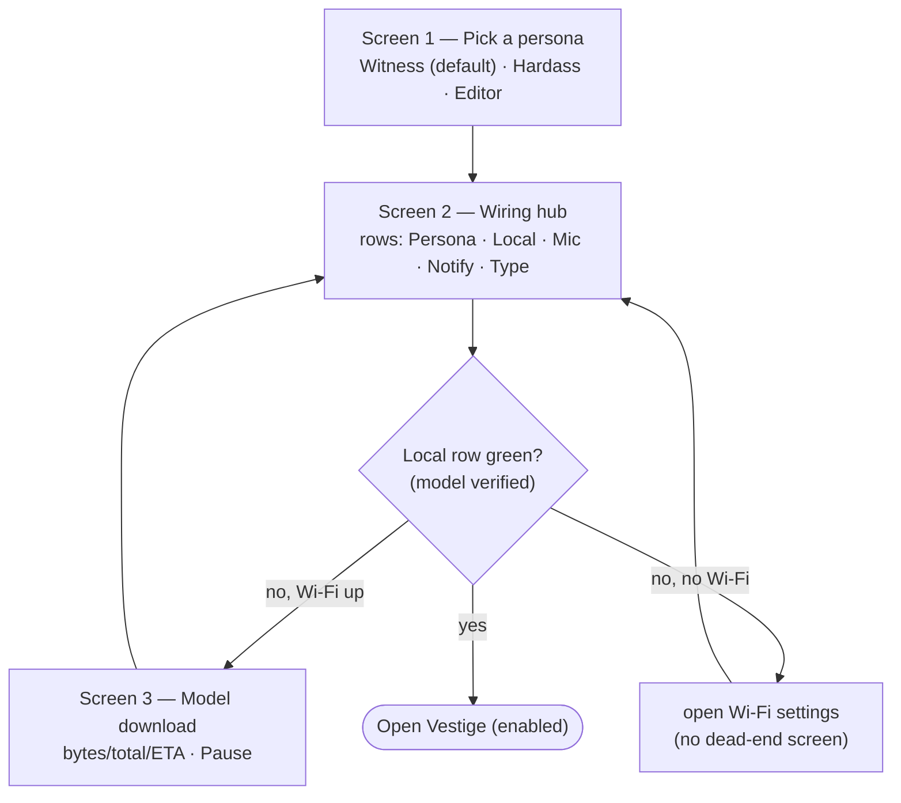
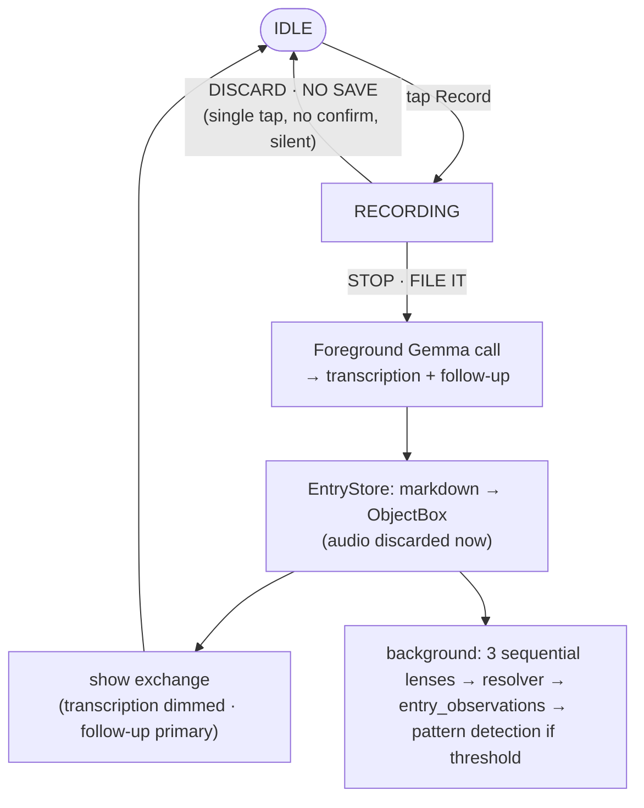
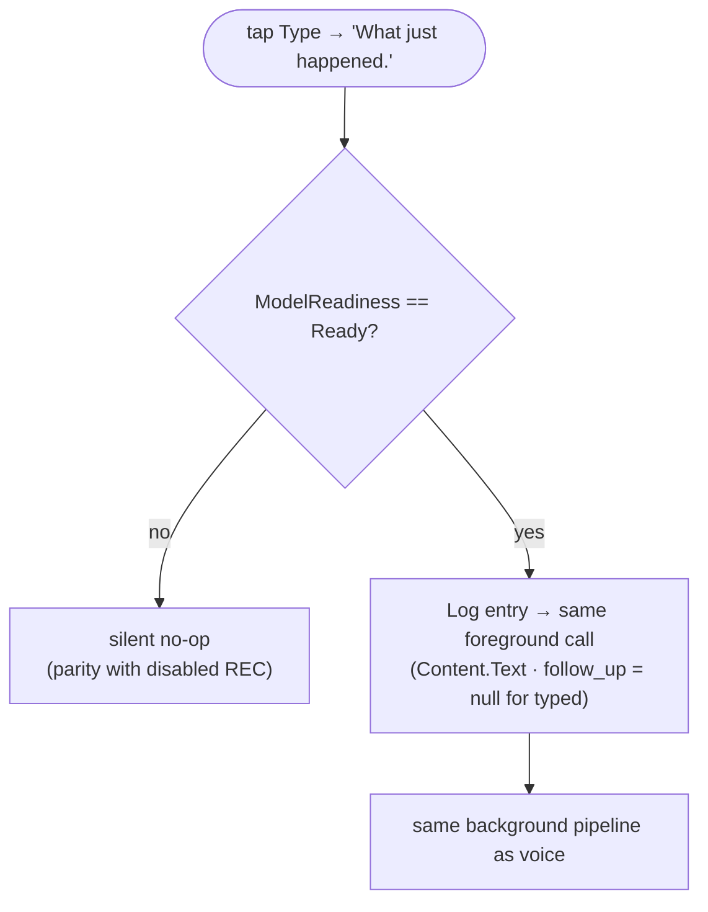
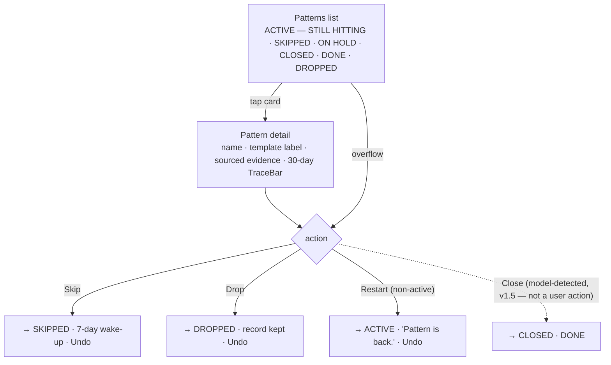
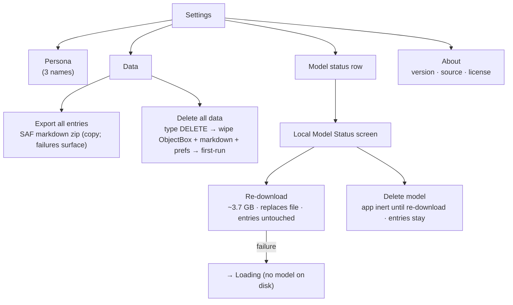

# User Flows

End-to-end paths through the shipped v1 surfaces. Source: ADR-004 Addendum (onboarding hub),
`ux-copy.md` + `spec-pattern-action-buttons.md` (patterns, settings), ADR-013 (typed parity),
`concept-locked.md` (capture, history).

---

## 1. Onboarding — 3-screen hub

Not a queue — a hub. Only the **Local** row gates entry; Mic and Notify are optional capability
switches that never block.

---

## 2. Voice capture

---

## 3. Typed capture (ADR-013 — model required)

Typed runs the **same** foreground call as voice. No model-free fallback: if `ModelReadiness`
is not `Ready`, `submitTyped` is a silent no-op (parity with a disabled REC button).

---

## 4. Patterns — list → detail → actions

Sections render only when non-empty, fixed order. User actions are **Skip / Drop / Restart**,
each with a ~4 s Undo snackbar. `CLOSED · DONE` is model-detected only (v1.5) — no user Close.

---

## 5. Settings & model lifecycle

Settings P0: Persona · Data (export / wipe) · Model (delegates to the Local Model Status screen) ·
About. Export is SAF `CreateDocument` (a copy, no storage permission); wipe is type-`DELETE`-gated
and returns to first-run.

