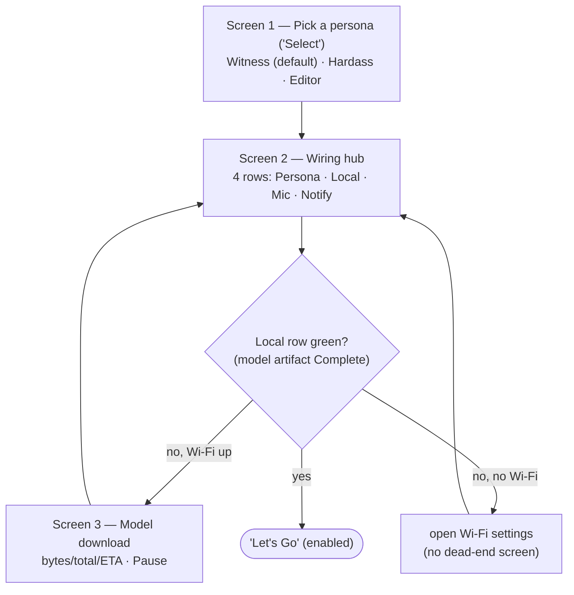
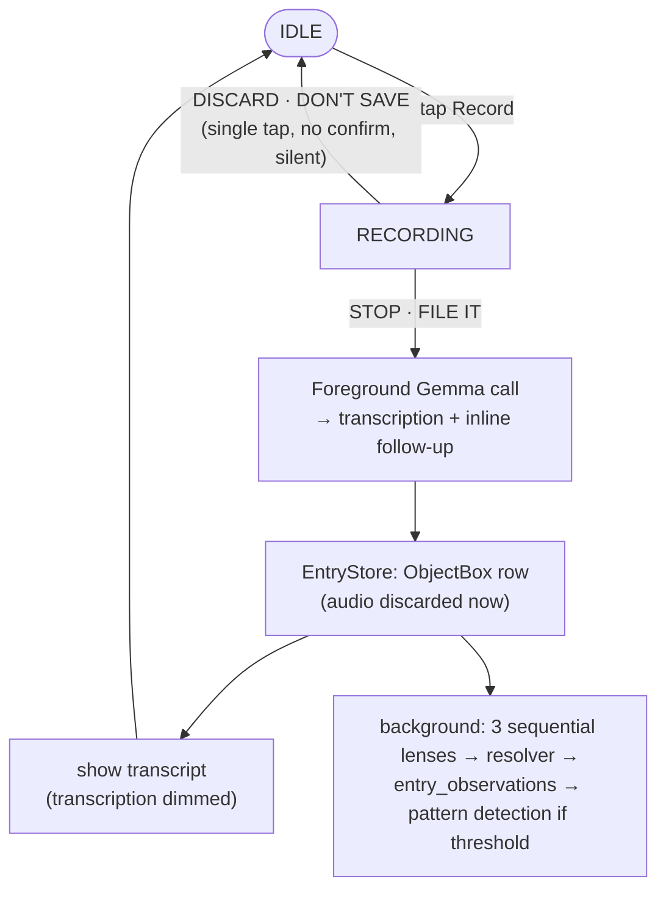
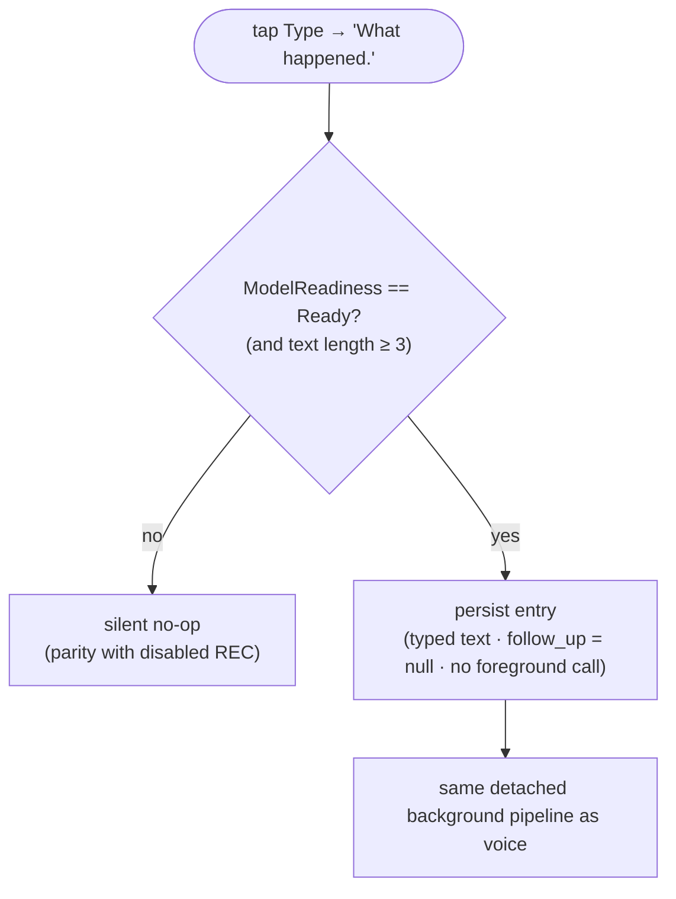
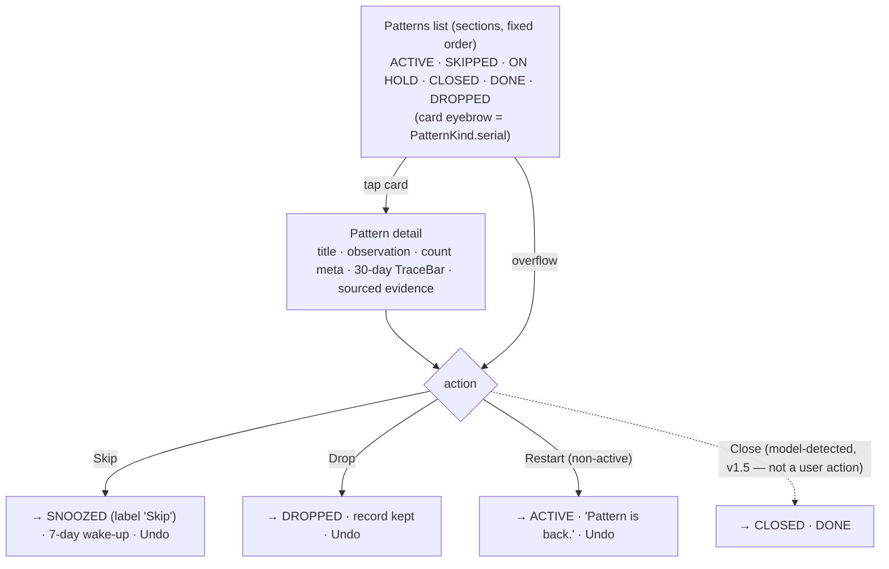
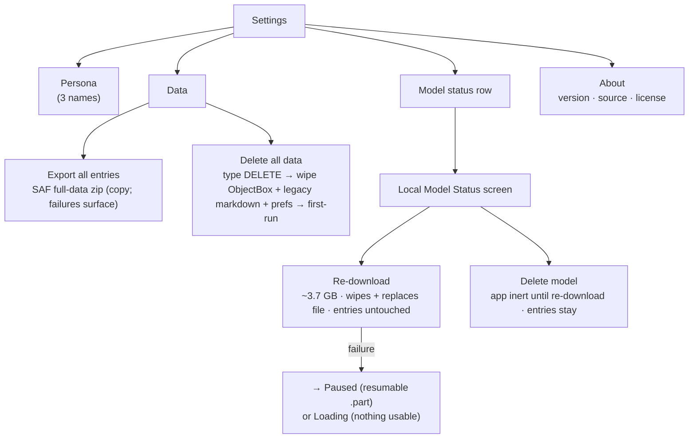
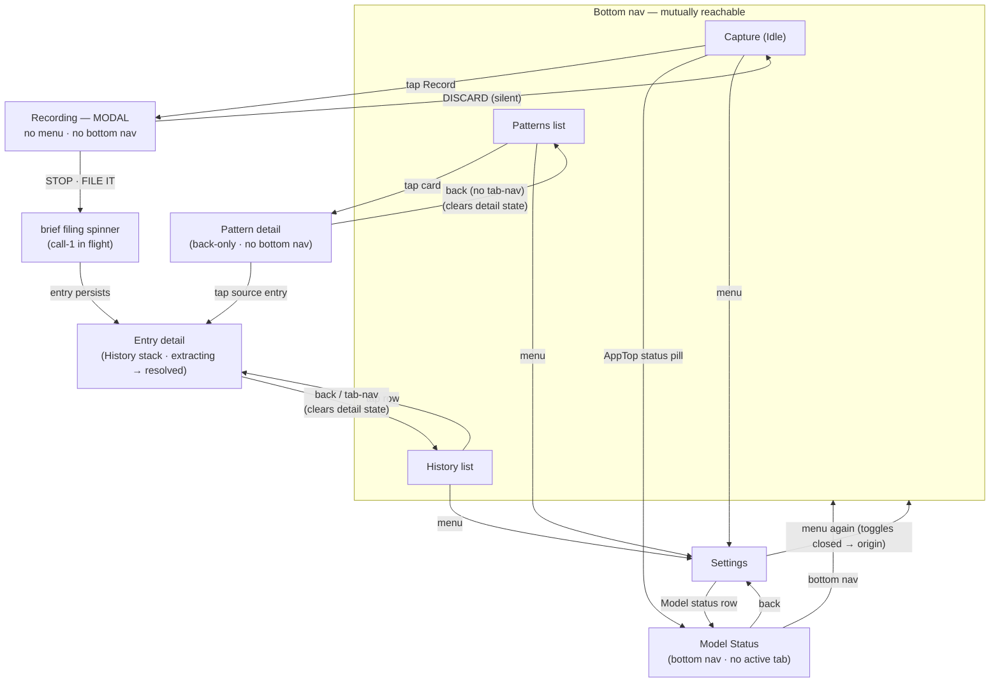

# User Flows

End-to-end paths through the shipped v1 surfaces. Source: ADR-004 Addendum (onboarding hub),
`ux-copy.md` + `spec-pattern-action-buttons.md` (patterns, settings), ADR-013 (typed parity),
`concept-locked.md` (capture, history).

---

## 1. Onboarding — 3-screen hub

Not a queue — a hub. The wiring hub has **4** rows (Persona · Local · Mic · Notify); typed entry is
not a wiring row. Only the **Local** row gates entry; Mic and Notify are optional capability
switches that never block. Primary buttons: Screen 1 "Select", Screen 2 "Let's Go" (enabled only
when Local is green).

```mermaid
flowchart TD
    accTitle: Onboarding three-screen hub flow
    accDescr: Screen one picks a persona and its button is Select. Screen two is a wiring hub with four rows, Persona, Local, Mic, and Notify; only the Local row gates entry. If the model is not present the user goes to Screen three to download it, then auto-returns to the hub. The Let's Go button is enabled only when the Local row is green.

    S1["Screen 1 — Pick a persona ('Select')<br/>Witness (default) · Hardass · Editor"] --> S2
    S2["Screen 2 — Wiring hub<br/>4 rows: Persona · Local · Mic · Notify"]
    S2 --> LOCAL{"Local row green?<br/>(model artifact Complete)"}
    LOCAL -- no, Wi-Fi up --> S3["Screen 3 — Model download<br/>bytes/total/ETA · Pause"]
    LOCAL -- no, no Wi-Fi --> WIFI["open Wi-Fi settings<br/>(no dead-end screen)"]
    WIFI --> S2
    S3 --> S2
    LOCAL -- yes --> OPEN(["'Let's Go' (enabled)"])
```

---

## 2. Voice capture

```mermaid
flowchart TD
    accTitle: Voice capture flow
    accDescr: Tap record to enter RECORDING. Discard during recording ends silently with no entry. Stop and file it triggers the foreground Gemma call returning transcription and one inline follow-up, persists an ObjectBox row, then runs the detached background three-lens extraction, convergence, observations, and periodic pattern detection.

    IDLE(["IDLE"]) -- "tap Record" --> REC["RECORDING"]
    REC -- "DISCARD · DON'T SAVE<br/>(single tap, no confirm, silent)" --> IDLE
    REC -- "STOP · FILE IT" --> FG["Foreground Gemma call<br/>→ transcription + inline follow-up"]
    FG --> PERSIST["EntryStore: ObjectBox row<br/>(audio discarded now)"]
    PERSIST --> SHOW["show transcript<br/>(transcription dimmed)"]
    PERSIST --> BG["background: 3 sequential lenses → resolver →<br/>entry_observations → pattern detection if threshold"]
    SHOW --> IDLE
```

---

## 3. Typed capture (ADR-013 + ADR-018 — model-gated, no foreground call)

Typed **persists the text directly** and does **not** make a foreground model call (ADR-018
superseded the ADR-013 typed-model-call). The model is still **required as a gate** for parity with
voice: if `ModelReadiness` is not `Ready` (or text is under 3 chars), `submitTyped` is a silent
no-op (parity with a disabled REC button). Background extraction is the same as voice.

```mermaid
flowchart TD
    accTitle: Typed capture flow is model-gated but skips the foreground call
    accDescr: The user taps Type and enters text. If the model readiness is Ready and the text is at least 3 characters, the typed text is persisted directly with no foreground call and a null follow-up, then the same detached background pipeline runs. If the model is not Ready, submit is a silent no-op matching the disabled record button.

    T(["tap Type → 'What happened.'"]) --> RDY{"ModelReadiness == Ready?<br/>(and text length ≥ 3)"}
    RDY -- no --> NOOP["silent no-op<br/>(parity with disabled REC)"]
    RDY -- yes --> LOG["persist entry<br/>(typed text · follow_up = null · no foreground call)"]
    LOG --> BG["same detached background pipeline as voice"]
```

---

## 4. Patterns — list → detail → actions

Sections render only when non-empty, fixed order. Section headers are **ACTIVE**, **SKIPPED · ON
HOLD**, **CLOSED · DONE**, **DROPPED** (`strings.xml`; mapped in `PatternFormatting`). User actions
are **Skip / Drop / Restart**, each with a `SnackbarDuration.Short` (~4 s) Undo snackbar.
`CLOSED · DONE` is model-detected only (v1.5) — no user Close. The kind/`template` eyebrow
(`PatternKind.serial`) is a **list-card** element, not a model `template_label`, and is not rendered
on the detail summary.

```mermaid
flowchart TD
    accTitle: Patterns list, detail, and lifecycle actions
    accDescr: The patterns list shows non-empty sections in fixed order ACTIVE, SKIPPED on hold, CLOSED done, DROPPED. A card opens detail with title, observation, count meta, a 30-day intensity TraceBar, and sourced evidence. From the card overflow or the detail action row the user can Skip (returns in 7 days), Drop (record kept), or Restart a non-active pattern, each with an Undo snackbar. Close is model-detected only.

    LIST["Patterns list (sections, fixed order)<br/>ACTIVE · SKIPPED · ON HOLD · CLOSED · DONE · DROPPED<br/>(card eyebrow = PatternKind.serial)"]
    LIST -- "tap card" --> DET["Pattern detail<br/>title · observation · count meta · 30-day TraceBar · sourced evidence"]
    DET --> ACT{"action"}
    LIST -- "overflow" --> ACT
    ACT -- "Skip" --> SK["→ SNOOZED (label 'Skip') · 7-day wake-up · Undo"]
    ACT -- "Drop" --> DR["→ DROPPED · record kept · Undo"]
    ACT -- "Restart (non-active)" --> RS["→ ACTIVE · 'Pattern is back.' · Undo"]
    ACT -. "Close (model-detected, v1.5 — not a user action)" .-> CL["→ CLOSED · DONE"]
```

---

## 5. Settings & model lifecycle

Settings P0: Persona · Data (export / wipe) · Model (delegates to the Local Model Status screen) ·
About. Export is SAF `CreateDocument` (a copy, no storage permission); wipe is type-`DELETE`-gated
and returns to first-run.

```mermaid
flowchart TD
    accTitle: Settings sections and model lifecycle
    accDescr: Settings has Persona, Data, Model, and About sections. Export writes a SAF zip of generated entry markdown plus a stored-data JSON snapshot as a copy. Delete all data requires typing DELETE then wipes ObjectBox, legacy markdown sidecars, and onboarding prefs and returns to first run. The Model row opens Model Status where Re-download and Delete live; re-download replaces the file with entries untouched, a failed re-download falls back to Loading.

    SET["Settings"] --> PER["Persona<br/>(3 names)"]
    SET --> DATA["Data"]
    SET --> MOD["Model status row"]
    SET --> ABT["About<br/>version · source · license"]

    DATA --> EXP["Export all entries<br/>SAF full-data zip (copy; failures surface)"]
    DATA --> WIPE["Delete all data<br/>type DELETE → wipe ObjectBox + legacy markdown + prefs → first-run"]

    MOD --> MS["Local Model Status screen"]
    MS --> RDL["Re-download<br/>~3.7 GB · wipes + replaces file · entries untouched"]
    MS --> DEL["Delete model<br/>app inert until re-download · entries stay"]
    RDL -- "failure" --> LOAD["→ Paused (resumable .part)<br/>or Loading (nothing usable)"]
```

---

## 6. Post-onboarding screen navigation

How the shipped surfaces connect after first-run. Three bottom-nav tabs
(Capture / Patterns / History) are mutually reachable on every primary screen. The
hamburger menu opens Settings from any primary screen and **toggles closed** back to the
screen it was opened from. Active recording is **modal**: the menu and bottom nav are
removed, so the only exits are STOP or DISCARD. Opening an **entry** detail (History) and then
tab-navigating away **clears** the detail state first, so re-entering the host lands on the list,
not a stale detail. A **pattern** detail has no bottom nav — it exits via Back only.

```mermaid
flowchart TD
    accTitle: Post-onboarding screen navigation map
    accDescr: Capture, Patterns, and History are mutually reachable via the bottom navigation on every primary screen. Tapping Record enters a modal Recording state with no menu or bottom nav; Discard returns to idle Capture and Stop persists the entry and opens its detail in the History stack. The hamburger menu opens Settings from any primary screen and toggles closed back to the origin screen. Settings Model row and the Capture AppTop status pill both open the Model Status screen, which has the bottom nav with no active tab. History opens an entry detail that keeps the bottom nav, and tab-navigating away from it clears the detail state so the host returns to its list. A Pattern detail is back-only — it has no bottom nav and clears its state on Back.

    subgraph TABS["Bottom nav — mutually reachable"]
        CAP["Capture (Idle)"]
        PAT["Patterns list"]
        HIS["History list"]
    end

    CAP -- "tap Record" --> REC["Recording — MODAL<br/>no menu · no bottom nav"]
    REC -- "DISCARD (silent)" --> CAP
    REC -- "STOP · FILE IT" --> SUB["brief filing spinner<br/>(call-1 in flight)"]
    SUB -- "entry persists" --> ED["Entry detail<br/>(History stack · extracting → resolved)"]

    HIS -- "tap row" --> ED
    PAT -- "tap card" --> PD["Pattern detail<br/>(back-only · no bottom nav)"]
    PD -- "tap source entry" --> ED
    ED -- "back / tab-nav<br/>(clears detail state)" --> HIS
    PD -- "back (no tab-nav)<br/>(clears detail state)" --> PAT

    CAP -- "AppTop status pill" --> MS["Model Status<br/>(bottom nav · no active tab)"]
    CAP -- "menu" --> SET["Settings"]
    PAT -- "menu" --> SET
    HIS -- "menu" --> SET
    SET -- "menu again (toggles closed → origin)" --> TABS
    SET -- "Model status row" --> MS
    MS -- "back" --> SET
    MS -- "bottom nav" --> TABS
```
